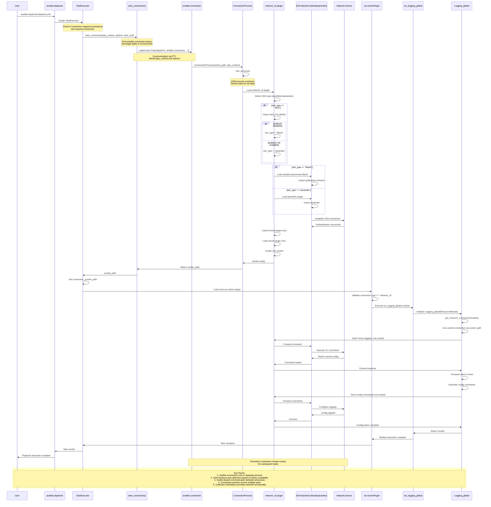

```mermaid
sequenceDiagram
    participant User as User
    participant AnsiblePlaybook as ansible-playbook
    participant TaskExecutor as TaskExecutor
    participant StartConnection as start_connection()
    participant AnsibleConnection as ansible-connection
    participant ConnectionProcess as ConnectionProcess
    participant NetworkCLI as network_cli plugin
    participant SSHBackend as SSH Backend (libssh/paramiko)
    participant Device as Network Device
    participant ActionPlugin as ios ActionPlugin
    participant Module as ios_logging_global
    participant ResourceModule as Logging_global

    User->>AnsiblePlaybook: ansible-playbook playbook.yml
    AnsiblePlaybook->>TaskExecutor: Create TaskExecutor
    
    Note over TaskExecutor: Check if connection supports persistence<br/>and requires connection
    
    TaskExecutor->>StartConnection: start_connection(play_context, options, task_uuid)
    
    Note over StartConnection: Find ansible-connection binary<br/>Set plugin paths in environment
    
    StartConnection->>AnsibleConnection: subprocess.Popen([python, ansible-connection, ...])
    
    Note over StartConnection,AnsibleConnection: Communication via PTY<br/>Sends play_context and options
    
    AnsibleConnection->>ConnectionProcess: ConnectionProcess(socket_path, play_context)
    ConnectionProcess->>ConnectionProcess: fork_process()
    
    Note over ConnectionProcess: Child process continues<br/>Parent waits for init data
    
    ConnectionProcess->>NetworkCLI: Load network_cli plugin
    NetworkCLI->>NetworkCLI: Detect SSH type (auto/libssh/paramiko)
    
    alt ssh_type == "auto"
        NetworkCLI->>NetworkCLI: Check HAS_PYLIBSSH
        alt pylibssh available
            NetworkCLI->>NetworkCLI: ssh_type = "libssh"
        else pylibssh not available
            NetworkCLI->>NetworkCLI: ssh_type = "paramiko"
        end
    end
    
    alt ssh_type == "libssh"
        NetworkCLI->>SSHBackend: Load ansible.netcommon.libssh
        SSHBackend->>SSHBackend: Import pylibsshext.Session
    else ssh_type == "paramiko"
        NetworkCLI->>SSHBackend: Load paramiko plugin
        SSHBackend->>SSHBackend: Import paramiko
    end
    
    SSHBackend->>Device: Establish SSH connection
    Device->>SSHBackend: Authentication successful
    
    NetworkCLI->>NetworkCLI: Load terminal plugin (ios)
    NetworkCLI->>NetworkCLI: Load cliconf plugin (ios)
    NetworkCLI->>NetworkCLI: Create unix socket
    
    NetworkCLI->>ConnectionProcess: Socket ready
    ConnectionProcess->>StartConnection: Return socket_path
    StartConnection->>TaskExecutor: socket_path
    
    TaskExecutor->>TaskExecutor: Set connection._socket_path
    TaskExecutor->>ActionPlugin: Load cisco.ios action plugin
    
    ActionPlugin->>ActionPlugin: Validate connection type == "network_cli"
    ActionPlugin->>Module: Execute ios_logging_global module
    
    Module->>ResourceModule: Initialize Logging_global(ResourceModule)
    ResourceModule->>ResourceModule: get_resource_connection(module)
    ResourceModule->>ResourceModule: Use cached connection via socket_path
    
    ResourceModule->>NetworkCLI: Send "show logging" (via socket)
    NetworkCLI->>SSHBackend: Forward command
    SSHBackend->>Device: Execute CLI command
    Device->>SSHBackend: Return current config
    SSHBackend->>NetworkCLI: Command output
    NetworkCLI->>ResourceModule: Parsed response
    
    ResourceModule->>ResourceModule: Compare want vs have
    ResourceModule->>ResourceModule: Generate config commands
    
    ResourceModule->>NetworkCLI: Send config commands (via socket)
    NetworkCLI->>SSHBackend: Forward commands
    SSHBackend->>Device: Configure logging
    Device->>SSHBackend: Config applied
    SSHBackend->>NetworkCLI: Success
    NetworkCLI->>ResourceModule: Configuration complete
    
    ResourceModule->>Module: Return results
    Module->>ActionPlugin: Module execution complete
    ActionPlugin->>TaskExecutor: Task complete
    TaskExecutor->>AnsiblePlaybook: Task results
    AnsiblePlaybook->>User: Playbook execution complete
    
    Note over AnsibleConnection,Device: Persistent connection remains active<br/>for subsequent tasks
    
    rect rgb(255, 255, 200)
        Note over User,ResourceModule: Key Points:<br/>1. ansible-connection runs in separate process<br/>2. SSH backend auto-detection based on library availability<br/>3. Socket-based communication between processes<br/>4. Connection persists across multiple tasks<br/>5. Collection inheritance provides network functionality
    end
```
