```mermaid
graph TB
    subgraph "Ansible Core Dependencies"
        AnsibleModule["`**AnsibleModule**
        ansible.module_utils.basic
        Core module framework`"]

        ConnectionBase["`**ConnectionBase**
        ansible.plugins.connection
        Base connection plugin`"]

        ActionBase["`**ActionBase**
        ansible.plugins.action
        Base action plugin`"]

        CliconfBaseBase["`**CliconfBase**
        ansible.plugins.cliconf
        Core CLI configuration`"]

        NetconfBaseBase["`**NetconfBase**
        ansible.plugins.netconf
        Core NETCONF plugin`"]

        HttpApiBaseBase["`**HttpApiBase**
        ansible.plugins.httpapi
        Core HTTP API plugin`"]

        AnsiblePlugin["`**AnsiblePlugin**
        ansible.plugins
        Base plugin class`"]

        BecomeBase["`**BecomeBase**
        ansible.plugins.become
        Privilege escalation`"]

        TerminalBaseBase["`**TerminalBase**
        ansible.plugins.terminal
        Terminal handling`"]
    end

    subgraph "ansible.utils Collection"
        PersistentConnectionBase["`**PersistentConnectionBase**
        ansible.utils.plugins.plugin_utils.connection_base
        Persistent connection framework`"]
    end

    subgraph "NetCommon Base Classes"
        NetworkConnectionBase["`**NetworkConnectionBase**
        plugin_utils/connection_base.py
        Network connection abstraction
        - Inherits: PersistentConnectionBase
        - Manages: sub-plugins, network_os
        - Provides: connection delegation`"]

        CliconfBase["`**CliconfBase**
        plugin_utils/cliconf_base.py
        CLI configuration interface
        - Inherits: CliconfBaseBase
        - Methods: send_command, get_config
        - Features: enable_mode decorator`"]

        NetconfBase["`**NetconfBase**
        plugin_utils/netconf_base.py
        NETCONF interface
        - Inherits: NetconfBaseBase
        - Methods: get, edit_config, commit
        - Features: ensure_ncclient decorator`"]

        HttpApiBase["`**HttpApiBase**
        plugin_utils/httpapi_base.py
        HTTP API interface
        - Inherits: HttpApiBaseBase
        - Methods: login, send_request
        - Features: session management`"]

        TerminalBase["`**TerminalBase**
        plugin_utils/terminal_base.py
        Terminal handling
        - Inherits: TerminalBaseBase
        - Methods: terminal_prompts, ansi_re
        - Features: prompt matching`"]
    end

    subgraph "NetCommon Core Classes"
        NetworkModule["`**NetworkModule**
        module_utils/network/common/network.py
        Network module base class
        - Inherits: AnsibleModule
        - Features: connection management
        - Methods: get_config, run_commands
        - Attributes: connection, config`"]

        Config["`**Config**
        module_utils/network/common/network.py
        Configuration handler
        - Methods: __call__, load_config
        - Features: command execution
        - Delegation: to connection object`"]

        NetconfConnection["`**NetconfConnection**
        module_utils/network/common/netconf.py
        NETCONF connection wrapper
        - Inherits: Connection
        - Methods: get_config, edit_config
        - Features: XML processing`"]

        ConfigLine["`**ConfigLine**
        module_utils/network/common/config.py
        Configuration line parser
        - Attributes: text, raw, parents, children
        - Methods: add_child, path
        - Features: hierarchical config`"]

        NetworkConfig["`**NetworkConfig**
        module_utils/network/common/config.py
        Network configuration parser
        - Methods: parse, get_section
        - Features: config diff, merge`"]

        RmEngineBase["`**RmEngineBase**
        module_utils/network/common/rm_base/resource_module_base.py
        Resource module base
        - Features: CRUD operations
        - States: merged, replaced, deleted
        - Methods: _get_connection`"]

        ResourceModule["`**ResourceModule**
        module_utils/network/common/rm_base/resource_module.py
        Resource module implementation
        - Inherits: RmEngineBase
        - Features: state management
        - Methods: execute_module`"]

        NetworkTemplate["`**NetworkTemplate**
        module_utils/network/common/rm_base/network_template.py
        Template engine for configs
        - Inherits: RmEngineBase
        - Features: Jinja2 templating
        - Methods: render, parse`"]
    end

    subgraph "Connection Plugin Implementations"
        NetworkCLIConn["`**Connection**
        connection/network_cli.py
        SSH CLI connection plugin
        - Inherits: NetworkConnectionBase
        - Transport: network_cli
        - Features: terminal, cliconf sub-plugins
        - Methods: send_command, get_prompt`"]

        NetconfConn["`**Connection**
        connection/netconf.py
        NETCONF connection plugin
        - Inherits: NetworkConnectionBase
        - Transport: netconf
        - Features: ncclient integration
        - Methods: get_config, edit_config`"]

        HttpApiConn["`**Connection**
        connection/httpapi.py
        HTTP API connection plugin
        - Inherits: NetworkConnectionBase
        - Transport: httpapi
        - Features: session management
        - Methods: send_request, login`"]

        GrpcConn["`**Connection**
        connection/grpc.py
        gRPC connection plugin
        - Inherits: NetworkConnectionBase
        - Transport: grpc
        - Features: protobuf handling
        - Methods: rpc_call, get_capabilities`"]

        PersistentConn["`**Connection**
        connection/persistent.py
        Persistent connection helper
        - Inherits: ConnectionBase
        - Transport: persistent
        - Features: socket management
        - Methods: exec_command, run`"]

        LibSSHConn["`**Connection**
        connection/libssh.py
        LibSSH connection plugin
        - Inherits: ConnectionBase
        - Transport: libssh
        - Features: fast SSH implementation
        - Methods: exec_command, put_file`"]
    end

    subgraph "Action Plugin Implementations"
        NetworkAction["`**ActionModule**
        action/network.py
        Network action base
        - Inherits: ActionModule (core)
        - Features: direct execution
        - Methods: run, _exec_module
        - Class: PatchedAnsibleModule`"]

        CLICommandAction["`**ActionModule**
        action/cli_command.py
        CLI command action
        - Inherits: ActionNetworkModule
        - Features: command execution
        - Methods: run`"]

        CLIConfigAction["`**ActionModule**
        action/cli_config.py
        CLI configuration action
        - Inherits: ActionNetworkModule
        - Features: config management
        - Methods: run`"]

        NetconfAction["`**ActionModule**
        action/netconf.py
        NETCONF action
        - Inherits: ActionNetworkModule
        - Features: XML operations
        - Methods: run`"]
    end

    subgraph "Sub-Plugin Implementations"
        DefaultCliconf["`**Cliconf**
        cliconf/default.py
        Default CLI configuration
        - Inherits: CliconfBase
        - Features: generic commands
        - Methods: get_config, edit_config`"]

        DefaultNetconf["`**Netconf**
        netconf/default.py
        Default NETCONF handler
        - Inherits: NetconfBase
        - Features: generic operations
        - Methods: get, edit_config`"]

        RestconfHttpApi["`**HttpApi**
        httpapi/restconf.py
        RESTCONF HTTP API handler
        - Inherits: HttpApiBase
        - Features: REST operations
        - Methods: login, send_request`"]
    end

    subgraph "Support Classes"
        CacheModule["`**CacheModule**
        cache/memory.py
        Memory cache plugin
        - Inherits: AnsiblePlugin
        - Features: in-memory storage
        - Methods: get, set, delete`"]

        FilterModule["`**FilterModule**
        filter/*.py
        Jinja2 filter plugins
        - Features: data transformation
        - Methods: filters property`"]

        BecomeModule["`**BecomeModule**
        become/enable.py
        Enable privilege escalation
        - Inherits: BecomeBase
        - Features: network device enable
        - Methods: build_become_command`"]
    end

    %% Inheritance relationships
    ConnectionBase --> PersistentConnectionBase
    PersistentConnectionBase --> NetworkConnectionBase
    NetworkConnectionBase --> NetworkCLIConn
    NetworkConnectionBase --> NetconfConn
    NetworkConnectionBase --> HttpApiConn
    NetworkConnectionBase --> GrpcConn
    ConnectionBase --> PersistentConn
    ConnectionBase --> LibSSHConn

    CliconfBaseBase --> CliconfBase
    CliconfBase --> DefaultCliconf

    NetconfBaseBase --> NetconfBase
    NetconfBase --> DefaultNetconf

    HttpApiBaseBase --> HttpApiBase
    HttpApiBase --> RestconfHttpApi

    TerminalBaseBase --> TerminalBase

    AnsibleModule --> NetworkModule
    AnsiblePlugin --> CacheModule
    BecomeBase --> BecomeModule

    ActionBase --> NetworkAction

    RmEngineBase --> ResourceModule
    RmEngineBase --> NetworkTemplate

    %% Composition relationships
    NetworkModule --> Config
    NetworkModule --> NetconfConnection
    NetworkCLIConn --> CliconfBase
    NetworkCLIConn --> TerminalBase
    NetconfConn --> NetconfBase
    HttpApiConn --> HttpApiBase

    NetworkConfig --> ConfigLine

    %% Usage relationships
    NetworkAction --> NetworkModule
    CLICommandAction --> NetworkCLIConn
    CLIConfigAction --> NetworkCLIConn
    NetconfAction --> NetconfConn

    classDef coreClass fill:#e3f2fd,stroke:#0277bd,stroke-width:2px
    classDef utilsClass fill:#e8f5e8,stroke:#2e7d32,stroke-width:2px
    classDef baseClass fill:#fff3e0,stroke:#f57c00,stroke-width:2px
    classDef netcommonClass fill:#f3e5f5,stroke:#7b1fa2,stroke-width:2px
    classDef connectionClass fill:#fce4ec,stroke:#c2185b,stroke-width:2px
    classDef actionClass fill:#e0f2f1,stroke:#00695c,stroke-width:2px
    classDef subpluginClass fill:#fff8e1,stroke:#ff8f00,stroke-width:2px
    classDef supportClass fill:#f1f8e9,stroke:#558b2f,stroke-width:2px

    class AnsibleModule,ConnectionBase,ActionBase,CliconfBaseBase,NetconfBaseBase,HttpApiBaseBase,AnsiblePlugin,BecomeBase,TerminalBaseBase coreClass
    class PersistentConnectionBase utilsClass
    class NetworkConnectionBase,CliconfBase,NetconfBase,HttpApiBase,TerminalBase baseClass
    class NetworkModule,Config,NetconfConnection,ConfigLine,NetworkConfig,RmEngineBase,ResourceModule,NetworkTemplate netcommonClass
    class NetworkCLIConn,NetconfConn,HttpApiConn,GrpcConn,PersistentConn,LibSSHConn connectionClass
    class NetworkAction,CLICommandAction,CLIConfigAction,NetconfAction actionClass
    class DefaultCliconf,DefaultNetconf,RestconfHttpApi subpluginClass
    class CacheModule,FilterModule,BecomeModule supportClass
```

# 🧬 INHERITANCE.md — Key Inheritance Patterns & Dependencies

## 📌 Key Inheritance Patterns

### 🔗 1️⃣ Connection Plugin Hierarchy

**Inheritance Chain:**

```
ConnectionBase (Ansible Core)
   ↓
PersistentConnectionBase (ansible.utils)
   ↓
NetworkConnectionBase (netcommon)
   ↓
Specific Implementations:
   ├─ network_cli
   ├─ netconf
   ├─ httpapi
   └─ grpc
```

**Purpose:**
Defines a layered connection model — from generic base to specialized network connections.

---

### 🧩 2️⃣ Sub-Plugin Base Classes

**Cliconf:**

```
CliconfBase (Ansible Core)
   ↓
CliconfBase (netcommon)
   ↓
Cliconf (device-specific)
```

**Netconf:**

```
NetconfBase (Ansible Core)
   ↓
NetconfBase (netcommon)
   ↓
Netconf (device-specific)
```

**HttpApi:**

```
HttpApiBase (Ansible Core)
   ↓
HttpApiBase (netcommon)
   ↓
HttpApi (device-specific)
```

**Purpose:**
Provides specialized extension points for device-specific plugins.

---

### ⚙️ 3️⃣ Module Framework

```
AnsibleModule (Ansible Core)
   ↓
NetworkModule (netcommon)
   ↓
Network-specific modules
```

**Resource Management:**

```
RmEngineBase (netcommon)
   ↓
ResourceModule
   ↓
NetworkTemplate
```

**Purpose:**
Encourages reusable logic and standardizes module behaviors for network devices.

---

## 📚 Key Dependencies

- **External:**

  - `ansible.utils.plugins.plugin_utils.connection_base.PersistentConnectionBase`
    Manages persistent SSH connections for network devices.

- **Ansible Core:**

  - Base classes for **plugins**, **modules**, and **actions**.

- **NetCommon:**
  - Provides specialized network abstractions extending Ansible Core functionality.

---

**Together, these inheritance patterns enable a robust, reusable, and consistent network automation ecosystem.** 🔗✨
