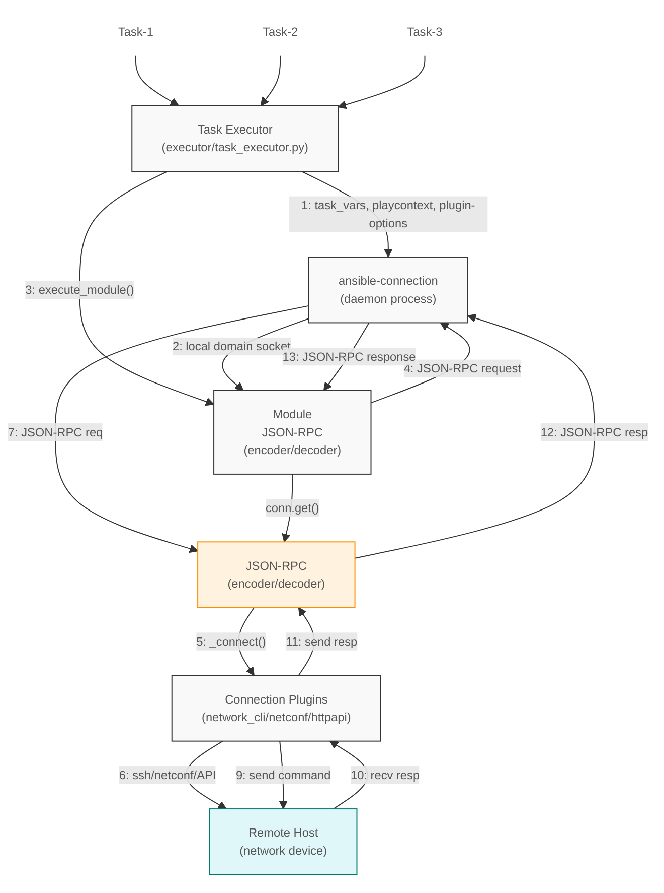

```mermaid
flowchart TD
  %% Style definitions
  classDef box fill:#f9f9f9,stroke:#333,stroke-width:1px
  classDef external fill:#e0f7fa,stroke:#00796b,stroke-width:1px
  classDef rpc fill:#fff3e0,stroke:#fb8c00,stroke-width:1px
  classDef label fill:none,stroke:none,color:#555,font-size:12px
  
  %% Nodes
  TE["Task Executor<br/>(executor/task_executor.py)"]:::box
  AC["ansible-connection<br/>(daemon process)"]:::box
  JSONRPC["JSON-RPC<br/>(encoder/decoder)"]:::rpc
  CP["Connection Plugins<br/>(network_cli/netconf/httpapi)"]:::box
  RH["Remote Host<br/>(network device)"]:::external
  MOD["Module<br/>JSON-RPC<br/>(encoder/decoder)"]:::box
   
  %% Tasks
  Task1["Task-1"]:::label
  Task2["Task-2"]:::label
  Task3["Task-3"]:::label
  
  %% Tasks to Executor
  Task1 --> TE
  Task2 --> TE
  Task3 --> TE
  
  %% Flow with labels
  TE -->|"1: task_vars, playcontext, plugin-options"| AC
  TE -->|"3: execute_module()"| MOD
  AC -->|"2: local domain socket"| MOD
  MOD -->|"4: JSON-RPC request"| AC
  AC -->|"7: JSON-RPC req"| JSONRPC
  JSONRPC -->|"5: _connect()"| CP
  CP -->|"6: ssh/netconf/API"| RH
  CP -->|"9: send command"| RH
  RH -->|"10: recv resp"| CP
  CP -->|"11: send resp"| JSONRPC
  JSONRPC -->|"12: JSON-RPC resp"| AC
  AC -->|"13: JSON-RPC response"| MOD
  
  %% Module connection call
  MOD -->|"conn.get()"| JSONRPC
```
