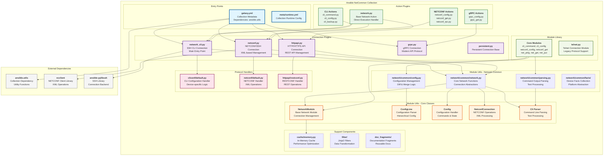

```mermaid
graph TB
    subgraph "Ansible NetCommon Collection"
        subgraph "Entry Points"
            Galaxy["`**galaxy.yml**
            Collection Metadata
            Dependencies: ansible.utils`"]
            
            Runtime["`**meta/runtime.yml**
            Collection Runtime Config`"]
        end
        
        subgraph "Connection Plugins"
            NetworkCLI["`**network_cli.py**
            SSH CLI Connection
            Main Entry Point`"]
            
            NetConf["`**netconf.py**
            NETCONF/SSH Connection
            XML-based Management`"]
            
            HTTPAPI["`**httpapi.py**
            HTTP/HTTPS API Connection
            REST API Management`"]
            
            GRPC["`**grpc.py**
            gRPC Connection
            Modern API Protocol`"]
            
            Persistent["`**persistent.py**
            Persistent Connection Base`"]
        end
        
        subgraph "Action Plugins"
            NetworkAction["`**network.py**
            Base Network Action
            Direct Execution Handler`"]
            
            CLIActions["`**CLI Actions**
            cli_command.py
            cli_config.py
            cli_backup.py`"]
            
            NetconfActions["`**NETCONF Actions**
            netconf_config.py
            netconf_get.py
            netconf_rpc.py`"]
            
            GRPCActions["`**gRPC Actions**
            grpc_config.py
            grpc_get.py`"]
        end
        
        subgraph "Module Utils - Core Classes"
            NetworkModule["`**NetworkModule**
            Base Network Module
            Connection Management`"]
            
            ConfigLine["`**ConfigLine**
            Configuration Parser
            Hierarchical Config`"]
            
            Config["`**Config**
            Configuration Handler
            Commands & State`"]
            
            NetconfConn["`**NetconfConnection**
            NETCONF Operations
            XML Processing`"]
            
            CLIParser["`**Cli Parser**
            Command Line Parsing
            Text Processing`"]
        end
        
        subgraph "Module Utils - Network Common"
            NetworkUtils["`**network/common/network.py**
            Core Network Functions
            Connection Abstractions`"]
            
            ConfigUtils["`**network/common/config.py**
            Configuration Management
            Diff & Merge Logic`"]
            
            ParsingUtils["`**network/common/parsing.py**
            Command Output Parsing
            Text Processing`"]
            
            FactsUtils["`**network/common/facts/**
            Device Facts Collection
            Platform Abstraction`"]
        end
        
        subgraph "Protocol Handlers"
            CLIConf["`**cliconf/default.py**
            CLI Configuration Handler
            Device-specific Logic`"]
            
            NetconfDefault["`**netconf/default.py**
            NETCONF Handler
            XML Operations`"]
            
            HTTPAPIDefault["`**httpapi/restconf.py**
            RESTCONF Handler
            REST Operations`"]
        end
        
        subgraph "Module Library"
            CoreModules["`**Core Modules**
            cli_command, cli_config
            netconf_config, netconf_get
            net_ping, net_get, net_put`"]
            
            TelnetModule["`**telnet.py**
            Telnet Connection Module
            Legacy Protocol Support`"]
        end
        
        subgraph "Support Components"
            CacheMemory["`**cache/memory.py**
            In-Memory Cache
            Performance Optimization`"]
            
            Filters["`**filter/**
            Jinja2 Filters
            Data Transformation`"]
            
            DocFragments["`**doc_fragments/**
            Documentation Fragments
            Reusable Docs`"]
        end
    end
    
    subgraph "External Dependencies"
        AnsibleUtils["`**ansible.utils**
            Collection Dependency
            Utility Functions`"]
        
        NCClient["`**ncclient**
            NETCONF Client Library
            XML Operations`"]
        
        LibSSH["`**ansible-pylibssh**
            SSH Library
            Connection Backend`"]
    end
    
    %% Connection Flow
    Galaxy --> NetworkCLI
    Galaxy --> NetConf
    Galaxy --> HTTPAPI
    Galaxy --> GRPC
    
    %% Action to Connection
    NetworkAction --> NetworkCLI
    NetworkAction --> NetConf
    NetworkAction --> HTTPAPI
    
    CLIActions --> NetworkCLI
    NetconfActions --> NetConf
    GRPCActions --> GRPC
    
    %% Connection to Utils
    NetworkCLI --> NetworkUtils
    NetConf --> NetworkUtils
    HTTPAPI --> NetworkUtils
    
    %% Utils Dependencies
    NetworkUtils --> NetworkModule
    NetworkUtils --> Config
    NetworkUtils --> NetconfConn
    NetworkUtils --> CLIParser
    
    ConfigUtils --> ConfigLine
    ParsingUtils --> CLIParser
    
    %% Protocol Handlers
    NetworkCLI --> CLIConf
    NetConf --> NetconfDefault
    HTTPAPI --> HTTPAPIDefault
    
    %% Module Dependencies
    CoreModules --> NetworkModule
    CoreModules --> ConfigUtils
    CoreModules --> ParsingUtils
    
    %% External Dependencies
    NetConf --> NCClient
    NetworkCLI --> LibSSH
    Galaxy --> AnsibleUtils
    
    %% Support
    NetworkModule --> CacheMemory
    
    classDef entryPoint fill:#e1f5fe,stroke:#01579b,stroke-width:3px
    classDef connection fill:#f3e5f5,stroke:#4a148c,stroke-width:2px
    classDef action fill:#e8f5e8,stroke:#2e7d32,stroke-width:2px
    classDef coreClass fill:#fff3e0,stroke:#e65100,stroke-width:2px
    classDef protocol fill:#fce4ec,stroke:#880e4f,stroke-width:2px
    classDef module fill:#f1f8e9,stroke:#33691e,stroke-width:2px
    classDef external fill:#f5f5f5,stroke:#424242,stroke-width:1px
    
    class Galaxy,Runtime entryPoint
    class NetworkCLI,NetConf,HTTPAPI,GRPC,Persistent connection
    class NetworkAction,CLIActions,NetconfActions,GRPCActions action
    class NetworkModule,ConfigLine,Config,NetconfConn,CLIParser coreClass
    class CLIConf,NetconfDefault,HTTPAPIDefault protocol
    class CoreModules,TelnetModule module
    class AnsibleUtils,NCClient,LibSSH external
```
#TODO
