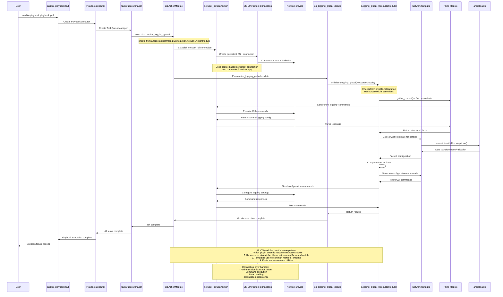

```mermaid
sequenceDiagram
    participant User as User
    participant CLI as ansible-playbook CLI
    participant Executor as PlaybookExecutor
    participant TQM as TaskQueueManager
    participant Action as ios ActionModule
    participant Connection as network_cli Connection
    participant SSH as SSH/Persistent Connection
    participant Device as Network Device
    participant Module as ios_logging_global Module
    participant ResourceModule as Logging_global (ResourceModule)
    participant Template as NetworkTemplate
    participant Facts as Facts Module
    participant Utils as ansible.utils

    User->>CLI: ansible-playbook playbook.yml
    CLI->>Executor: Create PlaybookExecutor
    Executor->>TQM: Create TaskQueueManager
    TQM->>Action: Load cisco.ios.ios_logging_global
    
    Note over Action: Inherits from ansible.netcommon.plugins.action.network.ActionModule
    
    Action->>Connection: Establish network_cli connection
    Connection->>SSH: Create persistent SSH connection
    SSH->>Device: Connect to Cisco IOS device
    
    Note over Connection,SSH: Uses socket-based persistent connection<br/>with connection/persistent.py
    
    Action->>Module: Execute ios_logging_global module
    Module->>ResourceModule: Initialize Logging_global(ResourceModule)
    
    Note over ResourceModule: Inherits from ansible.netcommon<br/>ResourceModule base class
    
    ResourceModule->>Facts: gather_current() - Get device facts
    Facts->>Connection: Send 'show logging' commands
    Connection->>Device: Execute CLI commands
    Device->>Connection: Return current logging config
    Connection->>Facts: Parse response
    Facts->>ResourceModule: Return structured facts
    
    ResourceModule->>Template: Use NetworkTemplate for parsing
    Template->>Utils: Use ansible.utils filters (optional)
    Utils->>Template: Data transformation/validation
    Template->>ResourceModule: Parsed configuration
    
    ResourceModule->>ResourceModule: Compare want vs have
    ResourceModule->>Template: Generate configuration commands
    Template->>ResourceModule: Return CLI commands
    
    ResourceModule->>Connection: Send configuration commands
    Connection->>Device: Configure logging settings
    Device->>Connection: Command responses
    Connection->>ResourceModule: Execution results
    
    ResourceModule->>Module: Return results
    Module->>Action: Module execution complete
    Action->>TQM: Task complete
    TQM->>Executor: All tasks complete
    Executor->>CLI: Playbook execution complete
    CLI->>User: Success/failure results

    Note over Action,ResourceModule: All IOS modules use the same pattern:<br/>1. Action plugin extends netcommon ActionModule<br/>2. Resource modules inherit from netcommon ResourceModule<br/>3. Templates use netcommon NetworkTemplate<br/>4. Facts use netcommon utilities
    
    Note over Connection,Device: Connection layer handles:<br/>- Authentication & authorization<br/>- Command execution<br/>- Error handling<br/>- Connection persistence
```
