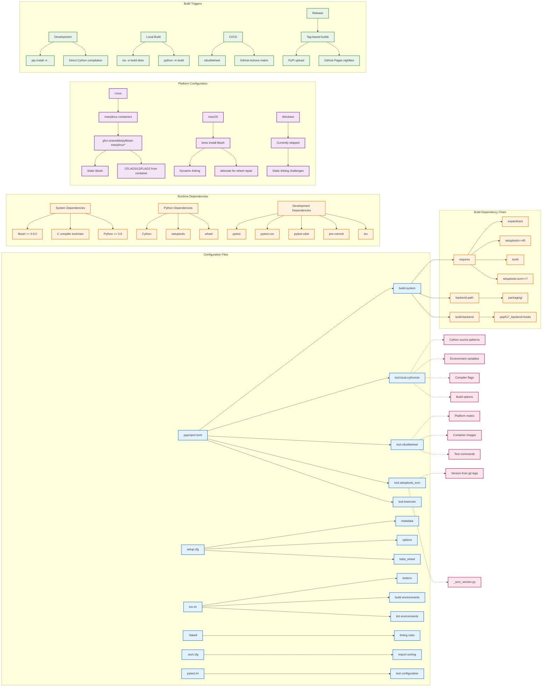

Detailed Build Process Analysis & Key Insights
I've created three comprehensive diagrams showing the build system's complexity and sophistication:

1. Complete Build Process Flow
The build system supports three distinct paths:

Development: Editable installs with in-place Cython compilation
Distribution: Clean source/wheel builds via tox
CI/CD: Multi-platform wheel building with cibuildwheel
2. Configuration Dependencies
Shows the intricate web of configuration files and their relationships, highlighting the sophisticated dependency management.

3. Troubleshooting & Debug Flow
Comprehensive guide for diagnosing and fixing common build issues.

🔑 Key Insights
1. Custom PEP517 Backend Architecture
packaging/pep517_backend/
├── hooks.py          # PEP517 entry points
├── _backend.py       # Core build logic
├── cli.py            # Cython CLI wrapper
└── _cython_configuration.py  # Config parser
Why Custom? Standard setuptools can't handle the complex Cython+libssh dependency chain efficiently.

2. Multi-Stage Cython Compilation
.pyx → .c → .so → Python extension
Stage 1: Cython translates .pyx to .c
Stage 2: C compiler creates .so shared libraries
Stage 3: Python imports compiled extensions
3. Platform-Specific Challenges
Platform	Challenge	Solution
Linux	libssh static linking	Custom manylinux containers with pre-built libssh
macOS	Dynamic library paths	brew install libssh + delocate wheel repair
Windows	Complex static linking	Currently skipped (too complex)
4. Build Configuration Hierarchy
pyproject.toml
├── [build-system]           # PEP517 backend specification
├── [tool.local.cythonize]   # Custom Cython configuration
├── [tool.cibuildwheel]      # CI wheel building
├── [tool.setuptools_scm]    # Version from git tags
└── [tool.towncrier]         # Changelog generation
5. Quality Assurance Pipeline
pre-commit hooks → flake8 + wemake-python-styleguide → pytest → build validation
6. Performance Optimizations
Parallel builds: -j auto for multi-core compilation
In-place development: Avoid full rebuilds during development
Constraint files: Pin build dependencies for reproducibility
Container caching: Reuse manylinux containers with pre-built libssh
7. Debugging Strategies
Quick Diagnostics:

# Check installation
python -c "import pylibsshext; print(pylibsshext.__version__)"

# Debug build
tox -e build-dists -v

# Test specific component
pytest tests/unit/session_test.py::test_make_session -v
Common Issues:

Missing libssh headers → Install libssh-dev
Cython compilation errors → Check .pyx syntax
Import errors → Rebuild extensions with tox -e clean
8. Advanced Build Features
Setuptools-scm: Automatic versioning from git tags
Towncrier: Automated changelog generation
Custom containers: ghcr.io/ansible/pylibssh-manylinux* with libssh
Wheel repair: delocate on macOS for dependency bundling
