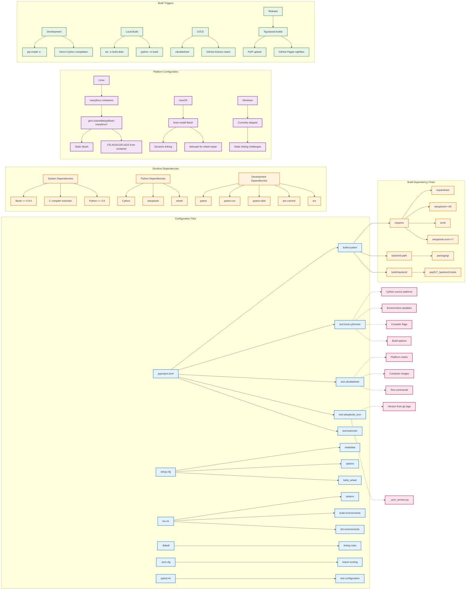

```mermaid
graph LR
    %% Configuration Dependencies
    subgraph "Configuration Files"
        A[pyproject.toml] --> B[build-system]
        A --> C[tool.local.cythonize]
        A --> D[tool.cibuildwheel]
        A --> E[tool.setuptools_scm]
        A --> F[tool.towncrier]
        
        G[setup.cfg] --> H[metadata]
        G --> I[options]
        G --> J[bdist_wheel]
        
        K[tox.ini] --> L[testenv]
        K --> M[build environments]
        K --> N[lint environments]
        
        O[.flake8] --> P[linting rules]
        Q[.isort.cfg] --> R[import sorting]
        S[pytest.ini] --> T[test configuration]
    end
    
    %% Build Dependencies Chain
    subgraph "Build Dependency Chain"
        B --> U[requires]
        U --> V[expandvars]
        U --> W[setuptools>=45]
        U --> X[tomli]
        U --> Y[setuptools-scm>=7]
        
        B --> Z[backend-path]
        Z --> AA[packaging/]
        B --> BB[build-backend]
        BB --> CC[pep517_backend.hooks]
    end
    
    %% Runtime Dependencies
    subgraph "Runtime Dependencies"
        DD[System Dependencies] --> EE[libssh >= 0.9.0]
        DD --> FF[C compiler toolchain]
        DD --> GG[Python >= 3.9]
        
        HH[Python Dependencies] --> II[Cython]
        HH --> JJ[setuptools]
        HH --> KK[wheel]
        
        LL[Development Dependencies] --> MM[pytest]
        LL --> NN[pytest-cov]
        LL --> OO[pytest-xdist]
        LL --> PP[pre-commit]
        LL --> QQ[tox]
    end
    
    %% Platform-specific Configuration
    subgraph "Platform Configuration"
        RR[Linux] --> SS[manylinux containers]
        SS --> TT[ghcr.io/ansible/pylibssh-manylinux*]
        TT --> UU[Static libssh]
        TT --> VV[CFLAGS/LDFLAGS from container]
        
        WW[macOS] --> XX[brew install libssh]
        XX --> YY[Dynamic linking]
        XX --> ZZ[delocate for wheel repair]
        
        AAA[Windows] --> BBB[Currently skipped]
        BBB --> CCC[Static linking challenges]
    end
    
    %% Build Process Triggers
    subgraph "Build Triggers"
        DDD[Development] --> EEE[pip install -e .]
        DDD --> FFF[Direct Cython compilation]
        
        GGG[Local Build] --> HHH[tox -e build-dists]
        GGG --> III[python -m build]
        
        JJJ[CI/CD] --> KKK[cibuildwheel]
        JJJ --> LLL[GitHub Actions matrix]
        
        MMM[Release] --> NNN[Tag-based builds]
        NNN --> OOO[PyPI upload]
        NNN --> PPP[GitHub Pages nightlies]
    end
    
    %% Data Flow
    C -.-> QQQ[Cython source patterns]
    C -.-> RRR[Environment variables]
    C -.-> SSS[Compiler flags]
    C -.-> TTT[Build options]
    
    D -.-> UUU[Platform matrix]
    D -.-> VVV[Container images]
    D -.-> WWW[Test commands]
    
    E -.-> XXX[Version from git tags]
    E -.-> YYY[_scm_version.py]
    
    %% Styling
    classDef config fill:#e3f2fd,stroke:#1976d2,stroke-width:2px
    classDef deps fill:#fff3e0,stroke:#f57c00,stroke-width:2px
    classDef platform fill:#f3e5f5,stroke:#7b1fa2,stroke-width:2px
    classDef triggers fill:#e8f5e8,stroke:#388e3c,stroke-width:2px
    classDef flow fill:#fce4ec,stroke:#c2185b,stroke-width:2px
    
    class A,B,C,D,E,F,G,H,I,J,K,L,M,N,O,P,Q,R,S,T config
    class U,V,W,X,Y,Z,AA,BB,CC,DD,EE,FF,GG,HH,II,JJ,KK,LL,MM,NN,OO,PP,QQ deps
    class RR,SS,TT,UU,VV,WW,XX,YY,ZZ,AAA,BBB,CCC platform
    class DDD,EEE,FFF,GGG,HHH,III,JJJ,KKK,LLL,MMM,NNN,OOO,PPP triggers
    class QQQ,RRR,SSS,TTT,UUU,VVV,WWW,XXX,YYY flow
```

