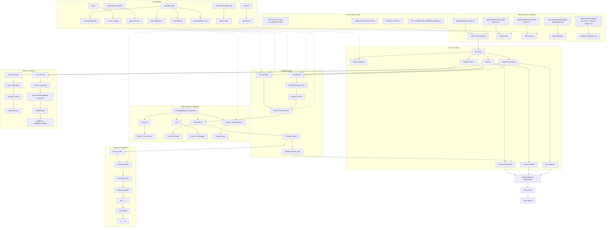

```mermaid
graph TD
    %% GitHub Actions Workflow Structure
    subgraph "GitHub Actions Workflows"
        A[".github/workflows/ci-cd.yml"] --> B["Main CI/CD Pipeline"]
        C[".github/workflows/reusable-linters.yml"] --> D["Linting Jobs"]
        E[".github/workflows/reusable-tests.yml"] --> F["Testing Jobs"]
        G[".github/workflows/reusable-cibuildwheel.yml"] --> H["Wheel Building"]
        I[".github/workflows/build-manylinux-container-images.yml"] --> J["Container Management"]
    end

    %% Main Pipeline Jobs
    subgraph "CI/CD Job Flow"
        B --> K["pre-setup"]
        K --> L["build-changelog"]
        K --> M["build-src"]
        K --> N["build-bin-macos"]
        K --> O["build-bin-manylinux"]
        M --> P["Source Distribution"]
        N --> Q["macOS Wheels"]
        O --> R["Linux Wheels"]
    end

    %% Custom PEP517 Backend
    subgraph "Custom PEP517 Backend"
        S["packaging/pep517_backend/"] --> T["hooks.py"]
        S --> U["_backend.py"]
        S --> V["cli.py"]
        S --> W["_cython_configuration.py"]

        T --> X["PEP517 Entry Points"]
        U --> Y["Core Build Logic"]
        V --> Z["Cython CLI Wrapper"]
        W --> AA["Config Parser"]
    end

    %% Build Process Flow
    subgraph "Build Process"
        M --> BB["tox build-dists"]
        BB --> CC["PEP517 Backend Call"]
        CC --> U
        U --> DD["Pre-build Cython"]
        DD --> EE["setuptools.build_meta"]
        EE --> P

        N --> FF["cibuildwheel"]
        O --> FF
        FF --> GG["Download Source Dist"]
        GG --> HH["Extract & Build"]
        HH --> CC
    end

    %% Cython Compilation
    subgraph "Cython Compilation"
        DD --> II["Find .pyx files"]
        II --> JJ["Set Environment"]
        JJ --> KK["LDFLAGS=-lssh"]
        KK --> LL["Cython Translate"]
        LL --> MM[".pyx → .c"]
        MM --> NN["C Compiler"]
        NN --> OO[".c → .so"]
    end

    %% Configuration Files
    subgraph "Configuration"
        PP["pyproject.toml"] --> QQ["build-system"]
        PP --> RR["tool.local.cythonize"]
        PP --> SS["tool.cibuildwheel"]
        PP --> TT["tool.setuptools_scm"]

        UU["tox.ini"] --> VV["testenv configs"]
        WW["requirements-build.txt"] --> XX["pip constraints"]
        YY[".pre-commit-config.yaml"] --> ZZ["quality hooks"]
        AAA["pytest.ini"] --> BBB["test settings"]
    end

    %% Platform Specific
    subgraph "Platform Handling"
        N --> CCC["macOS Runner"]
        CCC --> DDD["brew install libssh"]
        DDD --> EEE["Dynamic Linking"]
        EEE --> FFF["delocate repair"]

        O --> GGG["Linux Runner"]
        GGG --> HHH["Custom manylinux"]
        HHH --> III["ghcr.io/ansible/pylibssh-manylinux*"]
        III --> JJJ["Static libssh"]
        JJJ --> KKK["QEMU for ARM/PPC/S390X"]
    end

    %% Dependencies and Connections
    QQ -.-> CC
    RR -.-> W
    SS -.-> FF
    TT -.-> L
    VV -.-> BB
    XX -.-> BB
    ZZ -.-> D
    BBB -.-> F

    %% Artifact Flow
    P --> LLL["python-package-distributions"]
    Q --> LLL
    R --> LLL
    LLL --> MMM["twine check"]
    MMM --> NNN["PyPI Upload"]

    %% Environment Variables
    subgraph "Environment Setup"
        OOO["FORCE_COLOR=1"]
        PPP["PIP_DISABLE_PIP_VERSION_CHECK=1"]
        QQQ["CIBW_CONFIG_SETTINGS"]
        RRR["LDFLAGS, CFLAGS, LD_LIBRARY_PATH"]
    end

    OOO -.-> B
    PPP -.-> B
    QQQ -.-> FF
    RRR -.-> JJ
```
