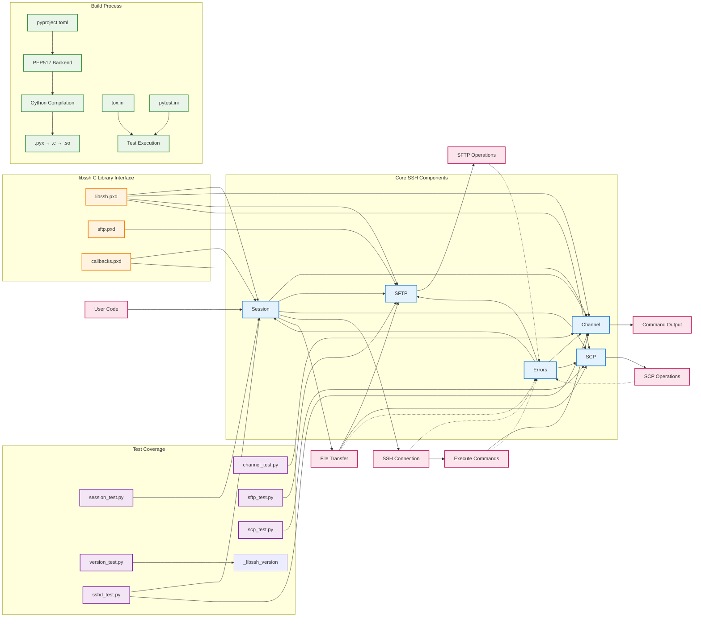

```mermaid
graph LR
    %% Core Components Flow
    subgraph "Core SSH Components"
        A[Session] --> B[Channel]
        A --> C[SFTP]
        A --> D[SCP]
        E[Errors] --> A
        E --> B
        E --> C
        E --> D
    end
    
    subgraph "libssh C Library Interface"
        F[libssh.pxd] --> A
        F --> B
        F --> C
        F --> D
        G[sftp.pxd] --> C
        H[callbacks.pxd] --> A
        H --> B
    end
    
    subgraph "Test Coverage"
        I[session_test.py] --> A
        J[channel_test.py] --> B
        K[sftp_test.py] --> C
        L[scp_test.py] --> D
        M[version_test.py] --> N[_libssh_version]
        O[sshd_test.py] --> A
        O --> B
    end
    
    subgraph "Build Process"
        P[pyproject.toml] --> Q[PEP517 Backend]
        Q --> R[Cython Compilation]
        R --> S[.pyx → .c → .so]
        T[tox.ini] --> U[Test Execution]
        V[pytest.ini] --> U
    end
    
    %% Data Flow
    W[User Code] --> A
    A --> X[SSH Connection]
    X --> Y[Execute Commands]
    Y --> B
    B --> Z[Command Output]
    
    A --> AA[File Transfer]
    AA --> C
    AA --> D
    C --> BB[SFTP Operations]
    D --> CC[SCP Operations]
    
    %% Error Handling
    X -.-> E
    Y -.-> E
    AA -.-> E
    BB -.-> E
    CC -.-> E
    
    %% Styling
    classDef core fill:#e3f2fd,stroke:#1976d2,stroke-width:2px
    classDef clib fill:#fff3e0,stroke:#f57c00,stroke-width:2px
    classDef test fill:#f3e5f5,stroke:#7b1fa2,stroke-width:2px
    classDef build fill:#e8f5e8,stroke:#388e3c,stroke-width:2px
    classDef flow fill:#fce4ec,stroke:#c2185b,stroke-width:2px
    
    class A,B,C,D,E core
    class F,G,H clib
    class I,J,K,L,M,O test
    class P,Q,R,S,T,U,V build
    class W,X,Y,Z,AA,BB,CC flow
```
