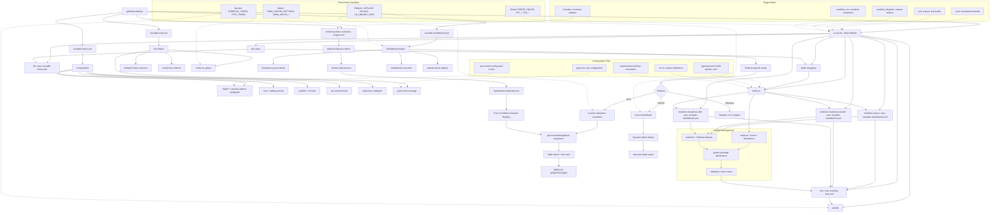

```mermaid
flowchart TD
    %% Workflow File Structure
    A[.github/workflows/] --> B[ci-cd.yml - Main Pipeline]
    A --> C[reusable-linters.yml]
    A --> D[reusable-tests.yml]
    A --> E[reusable-cibuildwheel.yml]
    A --> F[build-manylinux-container-images.yml]

    %% Main Pipeline Jobs
    B --> G[pre-setup]
    B --> H[lint: uses reusable-linters.yml]
    B --> I[build-changelog]
    B --> J[build-src]
    B --> K[build-bin-macos: uses reusable-cibuildwheel.yml]
    B --> L[build-bin-manylinux-tested: uses reusable-cibuildwheel.yml]
    B --> M[build-bin-manylinux-odd: uses reusable-cibuildwheel.yml]
    B --> N[test: uses reusable-tests.yml]
    B --> O[publish]

    %% Job Dependencies
    G --> H
    G --> I
    I --> J
    J --> K
    J --> L
    J --> M
    K --> N
    L --> N
    M --> N
    N --> O

    %% Reusable Workflow Details
    C --> P[Linting Matrix]
    P --> Q[flake8 + wemake-python-styleguide]
    P --> R[isort + trailing-comma]
    P --> S[yamllint + rst-linter]
    P --> T[pre-commit hooks]
    P --> U[build-docs validation]

    D --> V[Test Matrix]
    V --> W[Multiple Python versions]
    V --> X[Install from artifacts]
    V --> Y[pytest with coverage]
    V --> Z[Codecov upload]

    E --> AA[Cibuildwheel Matrix]
    AA --> BB[Download source tarball]
    AA --> CC[Platform-specific setup]
    AA --> DD[cibuildwheel execution]
    AA --> EE[Upload wheel artifacts]

    %% Platform-specific Details
    CC --> FF{Platform}
    FF -->|Linux| GG[Custom manylinux containers]
    FF -->|macOS| HH[brew install libssh]
    FF -->|Windows| II[Skipped - too complex]

    GG --> JJ[ghcr.io/ansible/pylibssh-manylinux*]
    JJ --> KK[Static libssh + dev tools]
    KK --> LL[QEMU for ARM/PPC/S390X]

    HH --> MM[Dynamic libssh linking]
    MM --> NN[delocate wheel repair]

    %% Container Build Pipeline
    F --> OO[Multi-architecture Matrix]
    OO --> PP[Docker build process]
    PP --> QQ[Install libssh dependencies]
    QQ --> RR[Push to GitHub Container Registry]
    RR --> JJ

    %% Artifact Flow
    subgraph "Artifact Management"
        SS[build-src: Source Distribution]
        TT[build-bin-*: Platform Wheels]
        UU[python-package-distributions]
        VV[Validation: twine check]
    end

    J --> SS
    K --> TT
    L --> TT
    M --> TT
    SS --> UU
    TT --> UU
    UU --> VV
    VV --> N

    %% Environment Configuration
    subgraph "Environment Variables"
        WW[Global: FORCE_COLOR, PIP_*, TOX_*]
        XX[Matrix: CIBW_CONFIG_SETTINGS, CIBW_ARCHS_*]
        YY[Secrets: CODECOV_TOKEN, PYPI_TOKEN]
        ZZ[Platform: LDFLAGS, CFLAGS, LD_LIBRARY_PATH]
    end

    %% Configuration Sources
    subgraph "Configuration Files"
        AAA[pyproject.toml: build-system, tool.*]
        BBB[tox.ini: testenv definitions]
        CCC[requirements-build.txt: constraints]
        DDD[.pre-commit-config.yaml: hooks]
        EEE[pytest.ini: test configuration]
    end

    %% Triggers and Conditions
    subgraph "Trigger Matrix"
        FFF[push: development builds]
        GGG[pull_request: test builds]
        HHH[workflow_dispatch: manual release]
        III[schedule: container updates]
        JJJ[workflow_run: container completion]
    end

    %% Connect configurations
    WW -.-> B
    XX -.-> AA
    YY -.-> Z
    YY -.-> O
    ZZ -.-> GG
    ZZ -.-> HH
    AAA -.-> J
    BBB -.-> J
    CCC -.-> J
    DDD -.-> Q
    EEE -.-> Y

    %% Connect triggers
    FFF -.-> B
    GGG -.-> B
    HHH -.-> B
    III -.-> F
    JJJ -.-> B
```
