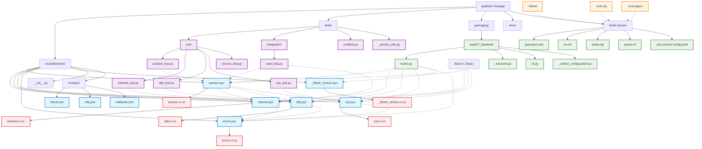

```mermaid
graph TD
    %% Main Package Structure
    A[pylibssh Package] --> B[src/pylibsshext/]
    A --> C[tests/]
    A --> D[packaging/]
    A --> E[docs/]
    A --> F[Build System]

    %% Core Cython Extensions
    B --> G[session.pyx]
    B --> H[channel.pyx]
    B --> I[sftp.pyx]
    B --> J[scp.pyx]
    B --> K[errors.pyx]
    B --> L[_libssh_version.pyx]
    B --> M[__init__.py]

    %% Header Files
    B --> N[includes/]
    N --> O[libssh.pxd]
    N --> P[sftp.pxd]
    N --> Q[callbacks.pxd]

    %% Compiled Extensions
    G --> G1[session.c/.so]
    H --> H1[channel.c/.so]
    I --> I1[sftp.c/.so]
    J --> J1[scp.c/.so]
    K --> K1[errors.c/.so]
    L --> L1[_libssh_version.c/.so]

    %% Test Structure
    C --> R[unit/]
    C --> S[integration/]
    C --> T[conftest.py]
    C --> U[_service_utils.py]

    %% Unit Tests
    R --> V[session_test.py]
    R --> W[channel_test.py]
    R --> X[sftp_test.py]
    R --> Y[scp_test.py]
    R --> Z[version_test.py]

    %% Integration Tests
    S --> AA[sshd_test.py]

    %% Custom Build Backend
    D --> BB[pep517_backend/]
    BB --> CC[hooks.py]
    BB --> DD[_backend.py]
    BB --> EE[cli.py]
    BB --> FF[_cython_configuration.py]

    %% Build System Components
    F --> GG[pyproject.toml]
    F --> HH[tox.ini]
    F --> II[setup.cfg]
    F --> JJ[pytest.ini]
    F --> KK[.pre-commit-config.yaml]

    %% Dependencies and Relationships
    G -.-> H
    G -.-> I
    G -.-> J
    H -.-> K
    I -.-> K
    J -.-> K

    %% Test Dependencies
    V -.-> G
    W -.-> H
    X -.-> I
    Y -.-> J
    AA -.-> G
    AA -.-> H

    %% Build Dependencies
    CC -.-> G
    CC -.-> H
    CC -.-> I
    CC -.-> J
    CC -.-> K
    CC -.-> L

    %% External Dependencies
    LL[libssh C library] -.-> G
    LL -.-> H
    LL -.-> I
    LL -.-> J

    %% Configuration Files
    MM[.flake8] -.-> F
    NN[.isort.cfg] -.-> F
    OO[.coveragerc] -.-> F

    %% Styling
    classDef cython fill:#e1f5fe,stroke:#0277bd,stroke-width:2px
    classDef test fill:#f3e5f5,stroke:#7b1fa2,stroke-width:2px
    classDef build fill:#e8f5e8,stroke:#388e3c,stroke-width:2px
    classDef config fill:#fff3e0,stroke:#f57c00,stroke-width:2px
    classDef compiled fill:#ffebee,stroke:#d32f2f,stroke-width:2px

    class G,H,I,J,K,L,O,P,Q cython
    class V,W,X,Y,Z,AA,R,S,T,U test
    class BB,CC,DD,EE,FF,GG,HH,II,JJ,KK build
    class MM,NN,OO config
    class G1,H1,I1,J1,K1,L1 compiled
```
