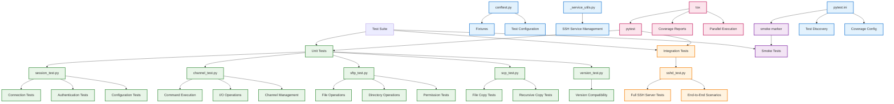

```mermaid
graph TD
    %% Test Strategy Overview
    A[Test Suite] --> B[Unit Tests]
    A --> C[Integration Tests]
    A --> D[Smoke Tests]

    %% Unit Test Structure
    B --> E[session_test.py]
    B --> F[channel_test.py]
    B --> G[sftp_test.py]
    B --> H[scp_test.py]
    B --> I[version_test.py]

    %% Integration Test Structure
    C --> J[sshd_test.py]

    %% Test Categories
    E --> K[Connection Tests]
    E --> L[Authentication Tests]
    E --> M[Configuration Tests]

    F --> N[Command Execution]
    F --> O[I/O Operations]
    F --> P[Channel Management]

    G --> Q[File Operations]
    G --> R[Directory Operations]
    G --> S[Permission Tests]

    H --> T[File Copy Tests]
    H --> U[Recursive Copy Tests]

    I --> V[Version Compatibility]

    J --> W[Full SSH Server Tests]
    J --> X[End-to-End Scenarios]

    %% Test Infrastructure
    Y[conftest.py] --> Z[Fixtures]
    Y --> AA[Test Configuration]
    BB[_service_utils.py] --> CC[SSH Service Management]

    %% Test Execution
    DD[pytest] --> B
    DD --> C
    EE[tox] --> DD
    EE --> FF[Coverage Reports]
    EE --> GG[Parallel Execution]

    %% Test Markers
    HH[smoke marker] --> D
    II[pytest.ini] --> HH
    II --> JJ[Test Discovery]
    II --> KK[Coverage Config]

    %% Styling
    classDef unit fill:#e8f5e8,stroke:#388e3c,stroke-width:2px
    classDef integration fill:#fff3e0,stroke:#f57c00,stroke-width:2px
    classDef smoke fill:#f3e5f5,stroke:#7b1fa2,stroke-width:2px
    classDef infra fill:#e3f2fd,stroke:#1976d2,stroke-width:2px
    classDef execution fill:#fce4ec,stroke:#c2185b,stroke-width:2px

    class B,E,F,G,H,I,K,L,M,N,O,P,Q,R,S,T,U,V unit
    class C,J,W,X integration
    class D,HH smoke
    class Y,Z,AA,BB,CC,II,JJ,KK infra
    class DD,EE,FF,GG execution
```
