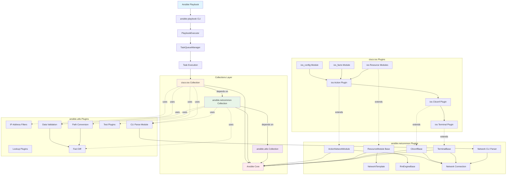

```mermaid
graph TD
    A[Ansible Playbook] --> B[ansible-playbook CLI]
    B --> C[PlaybookExecutor]
    C --> D[TaskQueueManager]
    D --> E[Task Execution]
    
    subgraph "Collections Layer"
        F[cisco.ios Collection]
        G[ansible.netcommon Collection]
        H[ansible.utils Collection]
        I[Ansible Core]
        
        %% Dependencies
        F -->|depends on| G
        G -->|depends on| H
        
        %% Core imports
        F --> I
        G --> I
        H --> I
    end
    
    subgraph "cisco.ios Plugins"
        J[ios_config Module]
        K[ios_facts Module]
        L[ios Action Plugin]
        M[ios Cliconf Plugin]
        N[ios Terminal Plugin]
        O[ios Resource Modules]
        
        %% IOS plugin relationships
        J --> L
        K --> L
        O --> L
        L --> M
        M --> N
    end
    
    subgraph "ansible.netcommon Plugins"
        P[ActionNetworkModule]
        Q[ResourceModule Base]
        R[CliconfBase]
        S[TerminalBase]
        T[NetworkTemplate]
        U[RmEngineBase]
        V[Network Connection]
        W[Network CLI Parser]
        
        %% Netcommon relationships
        P --> V
        Q --> U
        Q --> T
        R --> V
        S --> V
        W --> V
    end
    
    subgraph "ansible.utils Plugins"
        X[IP Address Filters]
        Y[Data Validation]
        Z[CLI Parse Module]
        AA[Test Plugins]
        BB[Lookup Plugins]
        CC[Fact Diff]
        DD[Path Conversion]
        
        %% Utils relationships
        Z --> W
        Y --> CC
        DD --> CC
    end
    
    %% Execution flow
    E --> F
    
    %% Plugin inheritance
    L -.->|extends| P
    M -.->|extends| R
    N -.->|extends| S
    O -.->|extends| Q
    
    %% Cross-collection usage
    F -.->|uses| X
    F -.->|uses| Y
    F -.->|uses| Z
    F -.->|uses| AA
    
    G -.->|uses| Y
    G -.->|uses| Z
    G -.->|uses| CC
    G -.->|uses| DD
    
    %% Core integration
    P --> I
    Q --> I
    R --> I
    S --> I
    
    style A fill:#e1f5fe
    style F fill:#fff3e0
    style G fill:#e8f5e8
    style H fill:#f3e5f5
    style I fill:#ffebee
```
