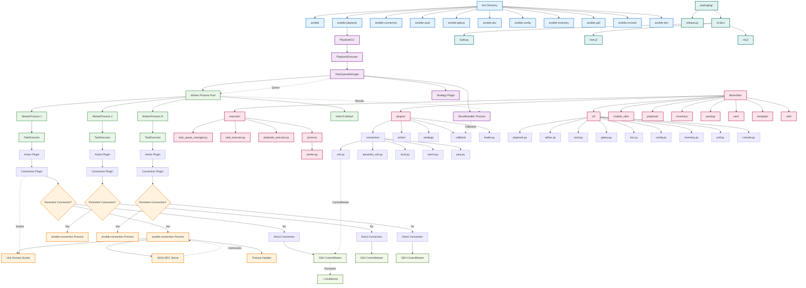

```mermaid
graph TD
    %% Entry Points in bin/
    BIN[bin/ Directory]
    BIN --> ANSIBLE_CMD[ansible]
    BIN --> ANSIBLE_PLAYBOOK[ansible-playbook]
    BIN --> ANSIBLE_CONNECTION[ansible-connection]
    BIN --> ANSIBLE_VAULT[ansible-vault]
    BIN --> ANSIBLE_GALAXY[ansible-galaxy]
    BIN --> ANSIBLE_DOC[ansible-doc]
    BIN --> ANSIBLE_CONFIG[ansible-config]
    BIN --> ANSIBLE_INVENTORY[ansible-inventory]
    BIN --> ANSIBLE_PULL[ansible-pull]
    BIN --> ANSIBLE_CONSOLE[ansible-console]
    BIN --> ANSIBLE_TEST[ansible-test]

    %% Main Process: ansible-playbook
    ANSIBLE_PLAYBOOK --> PLAYBOOK_CLI[PlaybookCLI]
    PLAYBOOK_CLI --> PLAYBOOK_EXECUTOR[PlaybookExecutor]
    PLAYBOOK_EXECUTOR --> TASK_QUEUE_MANAGER[TaskQueueManager]
    
    %% Multi-Process Architecture
    TASK_QUEUE_MANAGER --> RESULT_HANDLER[ResultHandler Process]
    TASK_QUEUE_MANAGER --> WORKER_POOL[Worker Process Pool]
    TASK_QUEUE_MANAGER --> STRATEGY[Strategy Plugin]
    
    %% Worker Processes
    WORKER_POOL --> WORKER1[WorkerProcess 1]
    WORKER_POOL --> WORKER2[WorkerProcess 2]
    WORKER_POOL --> WORKER3[WorkerProcess N]
    WORKER_POOL --> WORKER_FORKS[forks=5 default]
    
    %% Worker Process Components
    WORKER1 --> TASK_EXECUTOR1[TaskExecutor]
    WORKER2 --> TASK_EXECUTOR2[TaskExecutor]
    WORKER3 --> TASK_EXECUTOR3[TaskExecutor]
    
    %% Task Execution Flow
    TASK_EXECUTOR1 --> ACTION_PLUGIN[Action Plugin]
    TASK_EXECUTOR2 --> ACTION_PLUGIN2[Action Plugin]
    TASK_EXECUTOR3 --> ACTION_PLUGIN3[Action Plugin]
    
    %% Connection Management
    ACTION_PLUGIN --> CONNECTION_PLUGIN[Connection Plugin]
    ACTION_PLUGIN2 --> CONNECTION_PLUGIN2[Connection Plugin]
    ACTION_PLUGIN3 --> CONNECTION_PLUGIN3[Connection Plugin]
    
    %% Persistent Connection Process
    CONNECTION_PLUGIN --> PERSISTENT_CHECK{Persistent Connection?}
    CONNECTION_PLUGIN2 --> PERSISTENT_CHECK2{Persistent Connection?}
    CONNECTION_PLUGIN3 --> PERSISTENT_CHECK3{Persistent Connection?}
    
    PERSISTENT_CHECK -->|Yes| CONNECTION_PROCESS[ansible-connection Process]
    PERSISTENT_CHECK2 -->|Yes| CONNECTION_PROCESS2[ansible-connection Process]
    PERSISTENT_CHECK3 -->|Yes| CONNECTION_PROCESS3[ansible-connection Process]
    
    PERSISTENT_CHECK -->|No| DIRECT_CONNECTION[Direct Connection]
    PERSISTENT_CHECK2 -->|No| DIRECT_CONNECTION2[Direct Connection]
    PERSISTENT_CHECK3 -->|No| DIRECT_CONNECTION3[Direct Connection]
    
    %% Connection Process Details
    CONNECTION_PROCESS --> UNIX_SOCKET[Unix Domain Socket]
    CONNECTION_PROCESS --> JSON_RPC[JSON-RPC Server]
    CONNECTION_PROCESS --> TIMEOUT_HANDLER[Timeout Handler]
    
    %% SSH Multiplexing
    DIRECT_CONNECTION --> SSH_MULTIPLEXING[SSH ControlMaster]
    DIRECT_CONNECTION2 --> SSH_MULTIPLEXING2[SSH ControlMaster]
    DIRECT_CONNECTION3 --> SSH_MULTIPLEXING3[SSH ControlMaster]
    
    %% lib/ Directory Structure
    LIB[lib/ansible/]
    LIB --> CLI_LAYER[cli/]
    LIB --> EXECUTOR[executor/]
    LIB --> PLUGINS[plugins/]
    LIB --> MODULE_UTILS[module_utils/]
    LIB --> PLAYBOOK[playbook/]
    LIB --> INVENTORY[inventory/]
    LIB --> PARSING[parsing/]
    LIB --> VARS[vars/]
    LIB --> TEMPLATE[template/]
    LIB --> UTILS[utils/]
    
    %% Executor Components
    EXECUTOR --> TASK_QUEUE_MANAGER_LIB[task_queue_manager.py]
    EXECUTOR --> TASK_EXECUTOR_LIB[task_executor.py]
    EXECUTOR --> PLAYBOOK_EXECUTOR_LIB[playbook_executor.py]
    EXECUTOR --> PROCESS_DIR[process/]
    PROCESS_DIR --> WORKER_PY[worker.py]
    
    %% Plugin System
    PLUGINS --> CONNECTION_PLUGINS[connection/]
    PLUGINS --> ACTION_PLUGINS[action/]
    PLUGINS --> STRATEGY_PLUGINS[strategy/]
    PLUGINS --> CALLBACK_PLUGINS[callback/]
    PLUGINS --> LOADER[loader.py]
    
    %% Connection Plugin Types
    CONNECTION_PLUGINS --> SSH_PLUGIN[ssh.py]
    CONNECTION_PLUGINS --> PARAMIKO_SSH[paramiko_ssh.py]
    CONNECTION_PLUGINS --> LOCAL_PLUGIN[local.py]
    CONNECTION_PLUGINS --> WINRM_PLUGIN[winrm.py]
    CONNECTION_PLUGINS --> PSRP_PLUGIN[psrp.py]
    
    %% CLI Layer
    CLI_LAYER --> PLAYBOOK_CLI_LIB[playbook.py]
    CLI_LAYER --> ADHOC_CLI[adhoc.py]
    CLI_LAYER --> VAULT_CLI[vault.py]
    CLI_LAYER --> GALAXY_CLI[galaxy.py]
    CLI_LAYER --> DOC_CLI[doc.py]
    CLI_LAYER --> CONFIG_CLI[config.py]
    CLI_LAYER --> INVENTORY_CLI[inventory.py]
    CLI_LAYER --> PULL_CLI[pull.py]
    CLI_LAYER --> CONSOLE_CLI[console.py]
    
    %% Packaging
    PACKAGING[packaging/]
    PACKAGING --> RELEASE_PY[release.py]
    PACKAGING --> CLI_DOC[cli-doc/]
    CLI_DOC --> BUILD_PY[build.py]
    CLI_DOC --> MAN_J2[man.j2]
    CLI_DOC --> RST_J2[rst.j2]
    
    %% Process Communication
    TASK_QUEUE_MANAGER -.->|Queue| WORKER_POOL
    WORKER_POOL -.->|Results| RESULT_HANDLER
    RESULT_HANDLER -.->|Callbacks| CALLBACK_PLUGINS
    
    %% Connection Process Communication
    CONNECTION_PLUGIN -.->|Socket| UNIX_SOCKET
    JSON_RPC -.->|Commands| CONNECTION_PROCESS
    
    %% SSH Control Path
    SSH_PLUGIN -.->|ControlMaster| SSH_MULTIPLEXING
    SSH_MULTIPLEXING -.->|Persistent| SSH_CONTROL_PATH[~/.ansible/cp/]
    
    %% Styling
    classDef binEntry fill:#e3f2fd,stroke:#1976d2,stroke-width:2px
    classDef mainProcess fill:#f3e5f5,stroke:#7b1fa2,stroke-width:2px
    classDef workerProcess fill:#e8f5e8,stroke:#388e3c,stroke-width:2px
    classDef connectionProcess fill:#fff3e0,stroke:#f57c00,stroke-width:2px
    classDef libDirectory fill:#fce4ec,stroke:#c2185b,stroke-width:2px
    classDef packaging fill:#e0f2f1,stroke:#00695c,stroke-width:2px
    classDef communication fill:#f1f8e9,stroke:#558b2f,stroke-width:2px

    class BIN,ANSIBLE_CMD,ANSIBLE_PLAYBOOK,ANSIBLE_CONNECTION,ANSIBLE_VAULT,ANSIBLE_GALAXY,ANSIBLE_DOC,ANSIBLE_CONFIG,ANSIBLE_INVENTORY,ANSIBLE_PULL,ANSIBLE_CONSOLE,ANSIBLE_TEST binEntry
    class PLAYBOOK_CLI,PLAYBOOK_EXECUTOR,TASK_QUEUE_MANAGER,RESULT_HANDLER,STRATEGY mainProcess
    class WORKER_POOL,WORKER1,WORKER2,WORKER3,WORKER_FORKS,TASK_EXECUTOR1,TASK_EXECUTOR2,TASK_EXECUTOR3 workerProcess
    class CONNECTION_PROCESS,CONNECTION_PROCESS2,CONNECTION_PROCESS3,UNIX_SOCKET,JSON_RPC,TIMEOUT_HANDLER,PERSISTENT_CHECK,PERSISTENT_CHECK2,PERSISTENT_CHECK3 connectionProcess
    class LIB,CLI_LAYER,EXECUTOR,PLUGINS,MODULE_UTILS,PLAYBOOK,INVENTORY,PARSING,VARS,TEMPLATE,UTILS,TASK_QUEUE_MANAGER_LIB,TASK_EXECUTOR_LIB,PLAYBOOK_EXECUTOR_LIB,PROCESS_DIR,WORKER_PY libDirectory
    class PACKAGING,RELEASE_PY,CLI_DOC,BUILD_PY,MAN_J2,RST_J2 packaging
    class SSH_MULTIPLEXING,SSH_MULTIPLEXING2,SSH_MULTIPLEXING3,SSH_CONTROL_PATH communication
```
