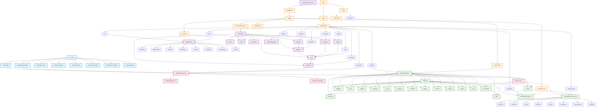

```mermaid
graph TD
    %% Entry Points
    CLI[CLI Tools]
    CLI --> ANSIBLE[bin/ansible]
    CLI --> PLAYBOOK[bin/ansible-playbook]
    CLI --> VAULT[bin/ansible-vault]
    CLI --> GALAXY[bin/ansible-galaxy]
    CLI --> DOC[bin/ansible-doc]
    CLI --> CONFIG[bin/ansible-config]
    CLI --> INVENTORY[bin/ansible-inventory]
    CLI --> PULL[bin/ansible-pull]

    %% Core Execution Flow
    ANSIBLE --> EXECUTOR[lib/ansible/executor/]
    PLAYBOOK --> EXECUTOR
    EXECUTOR --> PBE[PlaybookExecutor]
    EXECUTOR --> TQM[TaskQueueManager]
    EXECUTOR --> TE[TaskExecutor]

    %% Core Components
    CORE[lib/ansible/]
    CORE --> PARSING[parsing/]
    CORE --> PLAYBOOK_CORE[playbook/]
    CORE --> INVENTORY_CORE[inventory/]
    CORE --> VARS[vars/]
    CORE --> TEMPLATE[template/]
    CORE --> ERRORS[errors/]
    CORE --> UTILS[utils/]
    CORE --> CONTEXT[context.py]
    CORE --> CONFIG_CORE[config/]

    %% Plugin System
    PLUGINS[lib/ansible/plugins/]
    PLUGINS --> ACTION[action/]
    PLUGINS --> CONNECTION[connection/]
    PLUGINS --> CALLBACK[callback/]
    PLUGINS --> FILTER[filter/]
    PLUGINS --> LOOKUP[lookup/]
    PLUGINS --> INVENTORY_PLUGIN[inventory/]
    PLUGINS --> VARS_PLUGIN[vars/]
    PLUGINS --> STRATEGY[strategy/]
    PLUGINS --> TERMINAL[terminal/]
    PLUGINS --> HTTPAPI[httpapi/]
    PLUGINS --> CLICONF[cliconf/]
    PLUGINS --> NETCONF[netconf/]
    PLUGINS --> BECOME[become/]
    PLUGINS --> CACHE[cache/]
    PLUGINS --> SHELL[shell/]
    PLUGINS --> TEST[test/]
    PLUGINS --> LOADER[loader.py]

    %% Module System
    MODULES[lib/ansible/modules/]
    MODULE_UTILS[lib/ansible/module_utils/]
    MODULE_UTILS --> BASIC[basic.py]
    MODULE_UTILS --> COMMON[common/]
    MODULE_UTILS --> FACTS[facts/]
    MODULE_UTILS --> COMPAT[compat/]
    MODULE_UTILS --> URLS[urls.py]
    MODULE_UTILS --> SERVICE[service.py]
    MODULE_UTILS --> JSON[json_utils.py]
    MODULE_UTILS --> PARSING_UTILS[parsing/]

    %% Collections
    COLLECTIONS[lib/ansible/collections/]
    GALAXY_CORE[lib/ansible/galaxy/]

    %% CLI Layer
    CLI_LAYER[lib/ansible/cli/]
    CLI_LAYER --> ADHOC[adhoc.py]
    CLI_LAYER --> PLAYBOOK_CLI[playbook.py]
    CLI_LAYER --> VAULT_CLI[vault.py]
    CLI_LAYER --> GALAXY_CLI[galaxy.py]
    CLI_LAYER --> DOC_CLI[doc.py]
    CLI_LAYER --> CONFIG_CLI[config.py]
    CLI_LAYER --> INVENTORY_CLI[inventory.py]
    CLI_LAYER --> PULL_CLI[pull.py]

    %% Test Structure
    TESTS[test/]
    TESTS --> UNITS[units/]
    TESTS --> INTEGRATION[integration/]
    TESTS --> SANITY[sanity/]

    %% Unit Tests Structure
    UNITS --> UNITS_ANSIBLE[units/ansible/]
    UNITS_ANSIBLE --> UNITS_CLI[cli/]
    UNITS_ANSIBLE --> UNITS_PLUGINS[plugins/]
    UNITS_ANSIBLE --> UNITS_MODULES[modules/]
    UNITS_ANSIBLE --> UNITS_MODULE_UTILS[module_utils/]
    UNITS_ANSIBLE --> UNITS_EXECUTOR[executor/]
    UNITS_ANSIBLE --> UNITS_PLAYBOOK[playbook/]
    UNITS_ANSIBLE --> UNITS_INVENTORY[inventory/]
    UNITS_ANSIBLE --> UNITS_VARS[vars/]
    UNITS_ANSIBLE --> UNITS_TEMPLATE[template/]
    UNITS_ANSIBLE --> UNITS_PARSING[parsing/]
    UNITS_ANSIBLE --> UNITS_UTILS[utils/]
    UNITS_ANSIBLE --> UNITS_CONFIG[config/]
    UNITS_ANSIBLE --> UNITS_GALAXY[galaxy/]

    %% Integration Tests Structure
    INTEGRATION --> TARGETS[targets/]
    TARGETS --> MODULE_TESTS[Module Tests]
    TARGETS --> PLUGIN_TESTS[Plugin Tests]
    TARGETS --> CORE_TESTS[Core Feature Tests]
    TARGETS --> CLI_TESTS[CLI Tests]
    TARGETS --> ANSIBLE_TEST[ansible-test/]

    %% Sanity Tests Structure
    SANITY --> CODE_SMELL[code-smell/]
    SANITY --> IGNORE[ignore.txt]

    %% Execution Flow Connections
    TE --> ACTION
    TE --> CONNECTION
    TE --> MODULES
    TE --> MODULE_UTILS
    ACTION --> MODULES
    ACTION --> MODULE_UTILS
    CONNECTION --> SHELL
    CONNECTION --> BECOME

    %% Plugin Loading
    LOADER --> ACTION
    LOADER --> CONNECTION
    LOADER --> CALLBACK
    LOADER --> FILTER
    LOADER --> LOOKUP
    LOADER --> INVENTORY_PLUGIN
    LOADER --> VARS_PLUGIN
    LOADER --> STRATEGY
    LOADER --> TERMINAL
    LOADER --> HTTPAPI
    LOADER --> CLICONF
    LOADER --> NETCONF
    LOADER --> BECOME
    LOADER --> CACHE
    LOADER --> SHELL
    LOADER --> TEST

    %% Data Flow
    PARSING --> PLAYBOOK_CORE
    PLAYBOOK_CORE --> VARS
    VARS --> TEMPLATE
    TEMPLATE --> EXECUTOR
    INVENTORY_CORE --> VARS
    CONFIG_CORE --> VARS

    %% Testing Relationships
    UNITS_PLUGINS --> PLUGINS
    UNITS_MODULES --> MODULES
    UNITS_MODULE_UTILS --> MODULE_UTILS
    UNITS_EXECUTOR --> EXECUTOR
    UNITS_PLAYBOOK --> PLAYBOOK_CORE
    UNITS_INVENTORY --> INVENTORY_CORE
    UNITS_VARS --> VARS
    UNITS_TEMPLATE --> TEMPLATE
    UNITS_PARSING --> PARSING
    UNITS_UTILS --> UTILS
    UNITS_CONFIG --> CONFIG_CORE
    UNITS_GALAXY --> GALAXY_CORE
    UNITS_CLI --> CLI_LAYER

    MODULE_TESTS --> MODULES
    PLUGIN_TESTS --> PLUGINS
    CORE_TESTS --> CORE
    CLI_TESTS --> CLI_LAYER

    %% Styling
    classDef entryPoint fill:#e1f5fe,stroke:#0277bd,stroke-width:2px
    classDef core fill:#f3e5f5,stroke:#7b1fa2,stroke-width:2px
    classDef plugin fill:#e8f5e8,stroke:#388e3c,stroke-width:2px
    classDef test fill:#fff3e0,stroke:#f57c00,stroke-width:2px
    classDef execution fill:#fce4ec,stroke:#c2185b,stroke-width:2px

    class CLI,ANSIBLE,PLAYBOOK,VAULT,GALAXY,DOC,CONFIG,INVENTORY,PULL entryPoint
    class CORE,PARSING,PLAYBOOK_CORE,INVENTORY_CORE,VARS,TEMPLATE,ERRORS,UTILS,CONTEXT,CONFIG_CORE,COLLECTIONS,GALAXY_CORE,CLI_LAYER core
    class PLUGINS,ACTION,CONNECTION,CALLBACK,FILTER,LOOKUP,INVENTORY_PLUGIN,VARS_PLUGIN,STRATEGY,TERMINAL,HTTPAPI,CLICONF,NETCONF,BECOME,CACHE,SHELL,TEST,LOADER,MODULES,MODULE_UTILS plugin
    class TESTS,UNITS,INTEGRATION,SANITY,TARGETS,CODE_SMELL,UNITS_ANSIBLE,MODULE_TESTS,PLUGIN_TESTS,CORE_TESTS,CLI_TESTS,ANSIBLE_TEST test
    class EXECUTOR,PBE,TQM,TE execution
```
