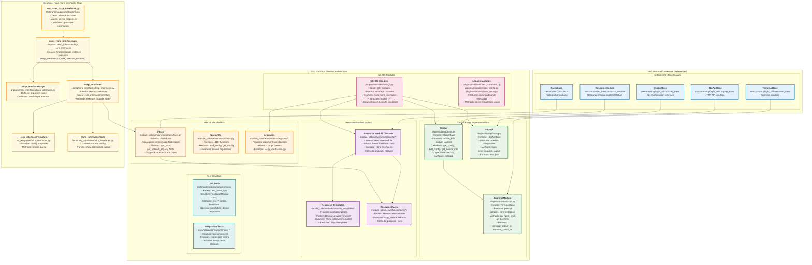

```mermaid
graph TB
    subgraph "NetCommon Framework (Referenced)"
        subgraph "NetCommon Base Classes"
            CliconfBase_NC["`**CliconfBase**
            netcommon.plugin_utils.cliconf_base
            CLI configuration interface`"]
            
            HttpApiBase_NC["`**HttpApiBase**
            netcommon.plugin_utils.httpapi_base
            HTTP API interface`"]
            
            TerminalBase_NC["`**TerminalBase**
            netcommon.plugin_utils.terminal_base
            Terminal handling`"]
            
            ResourceModule_NC["`**ResourceModule**
            netcommon.rm_base.resource_module
            Resource module implementation`"]
            
            FactsBase_NC["`**FactsBase**
            netcommon.facts.facts
            Facts gathering base`"]
        end
    end

    subgraph "Cisco NX-OS Collection Architecture"
        subgraph "NX-OS Plugin Implementations"
            NxosCliconf["`**Cliconf**
            plugins/cliconf/nxos.py
            - Inherits: CliconfBase
            - Features: device_info, module_context
            - Methods: get_config, edit_config, get_device_info
            - Capabilities: backup, configure, rollback`"]
            
            NxosHttpApi["`**HttpApi**
            plugins/httpapi/nxos.py
            - Inherits: HttpApiBase
            - Features: NX-API integration
            - Methods: login, send_request, logout
            - Formats: text, json`"]
            
            NxosTerminal["`**TerminalModule**
            plugins/terminal/nxos.py
            - Inherits: TerminalBase
            - Features: prompt patterns, error detection
            - Methods: on_open_shell, on_become
            - Patterns: terminal_stdout_re, terminal_stderr_re`"]
        end

        subgraph "NX-OS Module Utils"
            NxosFactsClass["`**Facts**
            module_utils/network/nxos/facts/facts.py
            - Inherits: FactsBase
            - Aggregates: all resource fact classes
            - Methods: get_facts, get_network_legacy_facts
            - Supports: 60+ resource types`"]
            
            NxosUtils["`**NxosUtils**
            module_utils/network/nxos/nxos.py
            - Provides: utility functions
            - Methods: load_config, get_config
            - Features: device capabilities`"]
            
            NxosArgspecs["`**Argspecs**
            module_utils/network/nxos/argspec/*/
            - Provides: argument specifications
            - Pattern: *Args classes
            - Example: Hsrp_interfacesArgs`"]
        end

        subgraph "Resource Module Pattern"
            ResourceModuleBase["`**Resource Module Classes**
            module_utils/network/nxos/config/*/
            - Inherits: ResourceModule
            - Pattern: ResourceName class
            - Example: Hsrp_interfaces
            - Methods: execute_module`"]
            
            ResourceTemplates["`**Resource Templates**
            module_utils/network/nxos/rm_templates/*/
            - Provides: config templates
            - Pattern: ResourceNameTemplate
            - Example: Hsrp_interfacesTemplate
            - Features: Jinja2 templates`"]
            
            ResourceFacts["`**Resource Facts**
            module_utils/network/nxos/facts/*/
            - Pattern: ResourceNameFacts
            - Example: Hsrp_interfacesFacts
            - Methods: populate_facts`"]
        end

        subgraph "NX-OS Modules"
            NxosModules["`**NX-OS Modules**
            plugins/modules/nxos_*.py
            - Count: 80+ modules
            - Pattern: resource modules
            - Example: nxos_hsrp_interfaces
            - Structure: main() -> ResourceClass().execute_module()`"]
            
            NxosLegacyModules["`**Legacy Modules**
            plugins/modules/nxos_command.py
            plugins/modules/nxos_config.py
            plugins/modules/nxos_facts.py
            - Features: command/config execution
            - Methods: direct connection usage`"]
        end

        subgraph "Test Structure"
            UnitTests["`**Unit Tests**
            tests/unit/modules/network/nxos/
            - Pattern: test_nxos_*.py
            - Structure: TestNxosModule class
            - Methods: test_*, setUp, tearDown
            - Mocking: connection, device responses`"]
            
            IntegrationTests["`**Integration Tests**
            tests/integration/targets/nxos_*/
            - Structure: tasks/main.yml
            - Features: real device testing
            - Includes: setup, tests, cleanup`"]
        end
    end

    subgraph "Example: nxos_hsrp_interfaces Flow"
        HSRPModule["`**nxos_hsrp_interfaces.py**
        - Imports: Hsrp_interfacesArgs, Hsrp_interfaces
        - Creates: AnsibleModule instance
        - Executes: Hsrp_interfaces(module).execute_module()`"]
        
        HSRPArgs["`**Hsrp_interfacesArgs**
        argspec/hsrp_interfaces/hsrp_interfaces.py
        - Defines: argument_spec
        - Validates: module parameters`"]
        
        HSRPConfig["`**Hsrp_interfaces**
        config/hsrp_interfaces/hsrp_interfaces.py
        - Inherits: ResourceModule
        - Uses: Hsrp_interfacesTemplate
        - Methods: execute_module, _state_*`"]
        
        HSRPTemplate["`**Hsrp_interfacesTemplate**
        rm_templates/hsrp_interfaces.py
        - Provides: config templates
        - Methods: render, parse`"]
        
        HSRPFacts["`**Hsrp_interfacesFacts**
        facts/hsrp_interfaces/hsrp_interfaces.py
        - Gathers: current config
        - Parses: show commands output`"]
        
        HSRPTest["`**test_nxos_hsrp_interfaces.py**
        tests/unit/modules/network/nxos/
        - Tests: all module states
        - Mocks: device responses
        - Validates: generated commands`"]
    end

    %% Inheritance relationships
    CliconfBase_NC --> NxosCliconf
    HttpApiBase_NC --> NxosHttpApi
    TerminalBase_NC --> NxosTerminal
    ResourceModule_NC --> ResourceModuleBase
    FactsBase_NC --> NxosFactsClass

    %% Composition relationships
    NxosModules --> ResourceModuleBase
    NxosModules --> NxosArgspecs
    ResourceModuleBase --> ResourceTemplates
    ResourceModuleBase --> ResourceFacts
    NxosFactsClass --> ResourceFacts

    %% Example Flow
    HSRPModule --> HSRPArgs
    HSRPModule --> HSRPConfig
    HSRPConfig --> HSRPTemplate
    HSRPConfig --> HSRPFacts
    HSRPConfig --> NxosFactsClass
    HSRPTest --> HSRPModule

    %% Connection Flow
    NxosModules --> NxosCliconf
    NxosModules --> NxosHttpApi
    NxosCliconf --> NxosTerminal

    classDef netcommonClass fill:#e3f2fd,stroke:#0277bd,stroke-width:2px
    classDef nxosPlugin fill:#e8f5e8,stroke:#2e7d32,stroke-width:2px
    classDef moduleUtils fill:#fff3e0,stroke:#f57c00,stroke-width:2px
    classDef resourcePattern fill:#f3e5f5,stroke:#7b1fa2,stroke-width:2px
    classDef modules fill:#fce4ec,stroke:#c2185b,stroke-width:2px
    classDef tests fill:#e0f2f1,stroke:#00695c,stroke-width:2px
    classDef example fill:#fff8e1,stroke:#ff8f00,stroke-width:2px

    class CliconfBase_NC,HttpApiBase_NC,TerminalBase_NC,ResourceModule_NC,FactsBase_NC netcommonClass
    class NxosCliconf,NxosHttpApi,NxosTerminal nxosPlugin
    class NxosFactsClass,NxosUtils,NxosArgspecs moduleUtils
    class ResourceModuleBase,ResourceTemplates,ResourceFacts resourcePattern
    class NxosModules,NxosLegacyModules modules
    class UnitTests,IntegrationTests tests
    class HSRPModule,HSRPArgs,HSRPConfig,HSRPTemplate,HSRPFacts,HSRPTest example
```
