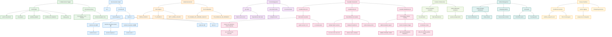

```mermaid
graph TD
    %% GitHub Actions Workflow Dependencies
    A[🔄 GitHub Actions Triggers] --> B[Event Types]
    B --> C[push to any branch]
    B --> D[pull_request]
    B --> E[workflow_dispatch]
    B --> F[workflow_run completion]
    B --> G[merge_group]

    %% Concurrency Control
    A --> H[Concurrency Group]
    H --> I[Per-workflow + ref + PR/SHA]
    H --> J[cancel-in-progress: true]

    %% Job Dependencies Flow
    K[Jobs Execution Graph] --> L[lint 🚨]
    K --> M[pre-setup ⚙️]
    M --> N[build-changelog 📝]
    M --> O[build-src 👷]
    O --> P[build-bin-macos 📦]
    O --> Q[build-bin-manylinux-tested 📦]
    O --> R[build-bin-manylinux-odd 📦]
    O --> S[build-rpms 📦]
    P --> T[test-bin-macos 🧪]
    Q --> U[test-bin-manylinux 🧪]
    R --> V[test-bin-exotic 🧪]
    O --> W[test-src 🧪]

    %% Environment Variables
    X[Global Environment] --> Y[Color Support]
    X --> Z[Tool Configuration]
    Y --> AA[FORCE_COLOR=1]
    Y --> BB[PY_COLORS=1]
    Y --> CC[MYPY_FORCE_COLOR=1]
    Z --> DD[PIP_DISABLE_PIP_VERSION_CHECK=1]
    Z --> EE[TOX_PARALLEL_NO_SPINNER=1]

    %% Caching Strategy
    FF[Cache Management] --> GG[pip cache]
    FF --> HH[pre-commit cache]
    FF --> II[tox environments]
    GG --> JJ[Python version hash]
    GG --> KK[Dependencies files hash]
    HH --> LL[Config files hash]

    %% Reusable Workflows
    MM[Reusable Components] --> NN[reusable-linters.yml]
    MM --> OO[reusable-tests.yml]
    MM --> PP[reusable-cibuildwheel.yml]

    %% Linters Workflow Detail
    NN --> QQ[Multi-matrix execution]
    QQ --> RR[toxenv: lint, build-docs, make-changelog]
    QQ --> SS[python-version: 3.11]
    QQ --> TT[os: ubuntu-latest]
    RR --> UU[pre-commit hooks execution]

    %% Tests Workflow Detail
    OO --> VV[Source/Binary test variants]
    VV --> WW[Multiple Python versions]
    VV --> XX[Multiple OS platforms]
    VV --> YY[Cython tracing control]
    WW --> ZZ[3.9, 3.10, 3.11, 3.12, 3.13]
    XX --> AAA[ubuntu, macos, windows]

    %% cibuildwheel Workflow Detail
    PP --> BBB[Cross-platform wheel building]
    BBB --> CCC[QEMU emulation support]
    BBB --> DDD[Custom manylinux images]
    BBB --> EEE[Architecture matrix]
    CCC --> FFF[ARM64, PPC64LE, S390X]
    DDD --> GGG[ghcr.io/ansible/pylibssh-manylinux_*]
    EEE --> HHH[x86_64, aarch64, ppc64le, s390x]

    %% Container Images
    III[Container Infrastructure] --> JJJ[Custom manylinux containers]
    III --> KKK[Fedora RPM build containers]
    JJJ --> LLL[Pre-built libssh]
    JJJ --> MMM[Static dependencies]
    KKK --> NNN[System package builds]

    %% Artifact Flow
    OOO[Artifact Management] --> PPP[python-package-distributions]
    OOO --> QQQ[changelog patches]
    OOO --> RRR[test results]
    PPP --> SSS[Source distributions]
    PPP --> TTT[Binary wheels]
    QQQ --> UUU[Version bump commits]
    RRR --> VVV[JUnit XML reports]
    RRR --> WWW[Coverage data]

    %% Release Process
    XXX[Release Workflow] --> YYY[Conditional execution]
    XXX --> ZZZ[Version tagging]
    XXX --> AAAA[Changelog generation]
    YYY --> BBBB[workflow_dispatch event]
    YYY --> CCCC[YOLO mode bypass]
    ZZZ --> DDDD[setuptools-scm integration]

    %% Styling
    classDef trigger fill:#e8f5e8,stroke:#388e3c,stroke-width:2px
    classDef job fill:#e3f2fd,stroke:#1976d2,stroke-width:2px
    classDef config fill:#fff3e0,stroke:#f57c00,stroke-width:2px
    classDef cache fill:#f3e5f5,stroke:#7b1fa2,stroke-width:2px
    classDef reusable fill:#fce4ec,stroke:#c2185b,stroke-width:2px
    classDef container fill:#f1f8e9,stroke:#689f38,stroke-width:2px
    classDef artifact fill:#e0f2f1,stroke:#00695c,stroke-width:2px
    classDef release fill:#fff8e1,stroke:#ff8f00,stroke-width:2px

    class A,B,C,D,E,F,G,H,I,J trigger
    class K,L,M,N,O,P,Q,R,S,T,U,V,W job
    class X,Y,Z,AA,BB,CC,DD,EE config
    class FF,GG,HH,II,JJ,KK,LL cache
    class MM,NN,OO,PP,QQ,RR,SS,TT,UU,VV,WW,XX,YY,ZZ,AAA,BBB,CCC,DDD,EEE,FFF,GGG,HHH reusable
    class III,JJJ,KKK,LLL,MMM,NNN container
    class OOO,PPP,QQQ,RRR,SSS,TTT,UUU,VVV,WWW artifact
    class XXX,YYY,ZZZ,AAAA,BBBB,CCCC,DDDD release
```
