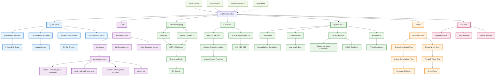

```mermaid
graph TD
    %% Main CI/CD Pipeline Overview
    A[🧪 CI/CD Workflow] --> B[📋 pre-setup]
    A --> C[🚨 lint]
    A --> D[📝 build-changelog]
    A --> E[👷 build-src]
    A --> F[📦 build-bin-*]
    A --> G[🧪 tests]
    A --> H[🚀 publish]

    %% Pre-setup Dependencies
    B --> I[Environment Variables]
    B --> J[Cache Keys Calculation]
    B --> K[Version Determination]
    B --> L[Artifact Names Setup]
    I --> M[Python 3.11 Setup]
    J --> N[setuptools-scm]
    K --> O[Git Tag Creation]

    %% Linting Pipeline
    C --> P[Reusable Linters]
    P --> Q[lint tox env]
    P --> R[build-docs tox env]
    P --> S[make-changelog tox env]
    Q --> T[pre-commit hooks]
    T --> U[flake8 + wemake-python-styleguide]
    T --> V[isort + add-trailing-comma]
    T --> W[yamllint + check-github-workflows]
    T --> X[cython-lint]

    %% Changelog Generation
    D --> Y[towncrier]
    D --> Z[pandoc conversion]
    Y --> AA[RST → Markdown]
    Z --> AA
    AA --> BB[Changelog Patch]
    BB --> CC[Git Commit]

    %% Source Distribution Build
    E --> DD[PEP517 Backend]
    E --> EE[Multiple Python Versions]
    DD --> FF[Custom Cython Compilation]
    EE --> GG[3.9, 3.10, 3.12]
    FF --> HH[setuptools-scm Versioning]

    %% Binary Wheel Builds
    F --> II[cibuildwheel]
    F --> JJ[macOS Builds]
    F --> KK[manylinux Builds]
    F --> LL[RPM Builds]
    II --> MM[Cross-platform Compilation]
    JJ --> NN[brew install libssh]
    KK --> OO[Custom manylinux Containers]
    KK --> PP[QEMU Emulation]
    LL --> QQ[Fedora Containers]

    %% Testing Pipeline
    G --> RR[Reusable Tests]
    RR --> SS[Source Distribution Tests]
    RR --> TT[Binary Wheel Tests]
    SS --> UU[Cython Compilation + Test]
    TT --> VV[Pre-built Wheel Test]
    UU --> WW[Coverage Collection]
    VV --> XX[Smoke Tests]

    %% Publication
    H --> YY[TestPyPI Upload]
    H --> ZZ[PyPI Release]
    H --> AAA[GitHub Release]

    %% Triggers and Conditions
    BBB[Push to devel] --> A
    CCC[Pull Request] --> A
    DDD[workflow_dispatch] --> A
    EEE[Dependabot] -.-> A

    %% Styling
    classDef setup fill:#e3f2fd,stroke:#1976d2,stroke-width:2px
    classDef lint fill:#f3e5f5,stroke:#7b1fa2,stroke-width:2px
    classDef build fill:#e8f5e8,stroke:#388e3c,stroke-width:2px
    classDef test fill:#fff3e0,stroke:#f57c00,stroke-width:2px
    classDef publish fill:#fce4ec,stroke:#c2185b,stroke-width:2px
    classDef trigger fill:#f1f8e9,stroke:#689f38,stroke-width:2px

    class B,I,J,K,L,M,N,O setup
    class C,P,Q,R,S,T,U,V,W,X lint
    class D,E,F,Y,Z,AA,BB,CC,DD,EE,FF,GG,HH,II,JJ,KK,LL,MM,NN,OO,PP,QQ build
    class G,RR,SS,TT,UU,VV,WW,XX test
    class H,YY,ZZ,AAA publish
    class BBB,CCC,DDD,EEE trigger
```
