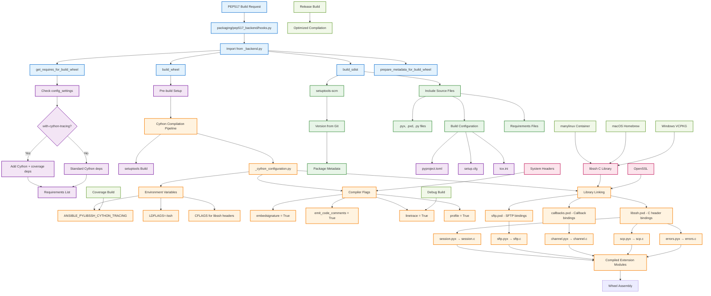

```mermaid
graph TD
    %% PEP517 Backend Build Process
    A[PEP517 Build Request] --> B[packaging/pep517_backend/hooks.py]
    B --> C[Import from _backend.py]

    %% Build Process Flow
    C --> D[get_requires_for_build_wheel]
    C --> E[build_wheel]
    C --> F[build_sdist]
    C --> G[prepare_metadata_for_build_wheel]

    %% Build Requirements Detection
    D --> H[Check config_settings]
    H --> I{with-cython-tracing?}
    I -->|Yes| J[Add Cython + coverage deps]
    I -->|No| K[Standard Cython deps]
    J --> L[Requirements List]
    K --> L

    %% Wheel Build Process
    E --> M[Pre-build Setup]
    M --> N[Cython Compilation Pipeline]
    N --> O[setuptools Build]

    %% Cython Compilation Details
    N --> P[_cython_configuration.py]
    P --> Q[Environment Variables]
    P --> R[Compiler Flags]
    P --> S[Library Linking]

    %% Environment Setup
    Q --> T[ANSIBLE_PYLIBSSH_CYTHON_TRACING]
    Q --> U[LDFLAGS=-lssh]
    Q --> V[CFLAGS for libssh headers]

    %% Compiler Configuration
    R --> W[embedsignature = True]
    R --> X[emit_code_comments = True]
    R --> Y[linetrace = True]
    R --> Z[profile = True]

    %% Library Dependencies
    S --> AA[libssh.pxd - C header bindings]
    S --> BB[sftp.pxd - SFTP bindings]
    S --> CC[callbacks.pxd - Callback bindings]

    %% Source Files Compilation
    AA --> DD[session.pyx → session.c]
    BB --> EE[sftp.pyx → sftp.c]
    CC --> FF[channel.pyx → channel.c]
    AA --> GG[scp.pyx → scp.c]
    AA --> HH[errors.pyx → errors.c]

    %% Final Assembly
    DD --> II[Compiled Extension Modules]
    EE --> II
    FF --> II
    GG --> II
    HH --> II
    II --> JJ[Wheel Assembly]

    %% Metadata Generation
    F --> KK[setuptools-scm]
    KK --> LL[Version from Git]
    LL --> MM[Package Metadata]

    %% Source Distribution
    F --> NN[Include Source Files]
    NN --> OO[.pyx, .pxd, .py files]
    NN --> PP[Build Configuration]
    NN --> QQ[Requirements Files]

    %% Configuration Sources
    PP --> RR[pyproject.toml]
    PP --> SS[setup.cfg]
    PP --> TT[tox.ini]

    %% External Dependencies
    UU[libssh C Library] --> S
    VV[OpenSSL] --> S
    WW[System Headers] --> R

    %% Build Variants
    XX[Debug Build] --> Y
    YY[Release Build] --> ZZ[Optimized Compilation]
    AAA[Coverage Build] --> T

    %% Platform Specifics
    BBB[manylinux Container] --> UU
    CCC[macOS Homebrew] --> UU
    DDD[Windows VCPKG] --> UU

    %% Styling
    classDef pep517 fill:#e3f2fd,stroke:#1976d2,stroke-width:2px
    classDef cython fill:#fff3e0,stroke:#f57c00,stroke-width:2px
    classDef config fill:#f3e5f5,stroke:#7b1fa2,stroke-width:2px
    classDef source fill:#e8f5e8,stroke:#388e3c,stroke-width:2px
    classDef external fill:#fce4ec,stroke:#c2185b,stroke-width:2px
    classDef platform fill:#f1f8e9,stroke:#689f38,stroke-width:2px

    class A,B,C,D,E,F,G pep517
    class N,P,Q,R,S,T,U,V,W,X,Y,Z,AA,BB,CC,DD,EE,FF,GG,HH,II cython
    class H,I,J,K,L,M,O,RR,SS,TT config
    class NN,OO,PP,QQ,KK,LL,MM source
    class UU,VV,WW external
    class BBB,CCC,DDD,XX,YY,ZZ,AAA platform
```
