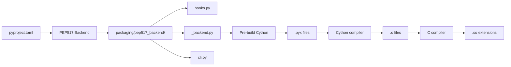

```mermaid
graph LR
    A[pyproject.toml] --> B[PEP517 Backend]
    B --> C[packaging/pep517_backend/]
    C --> D[hooks.py]
    C --> E[_backend.py]
    C --> F[cli.py]

    E --> G[Pre-build Cython]
    G --> H[.pyx files]
    H --> I[Cython compiler]
    I --> J[.c files]
    J --> K[C compiler]
    K --> L[.so extensions]
```
