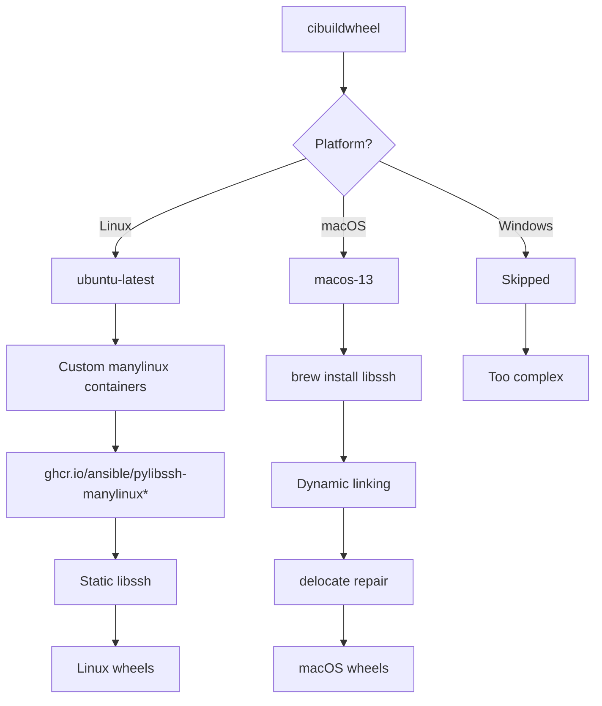

```mermaid
graph TD
    A[cibuildwheel] --> B{Platform?}

    B -->|Linux| C[ubuntu-latest]
    C --> D[Custom manylinux containers]
    D --> E[ghcr.io/ansible/pylibssh-manylinux*]
    E --> F[Static libssh]
    F --> G[Linux wheels]

    B -->|macOS| H[macos-13]
    H --> I[brew install libssh]
    I --> J[Dynamic linking]
    J --> K[delocate repair]
    K --> L[macOS wheels]

    B -->|Windows| M[Skipped]
    M --> N[Too complex]
```
