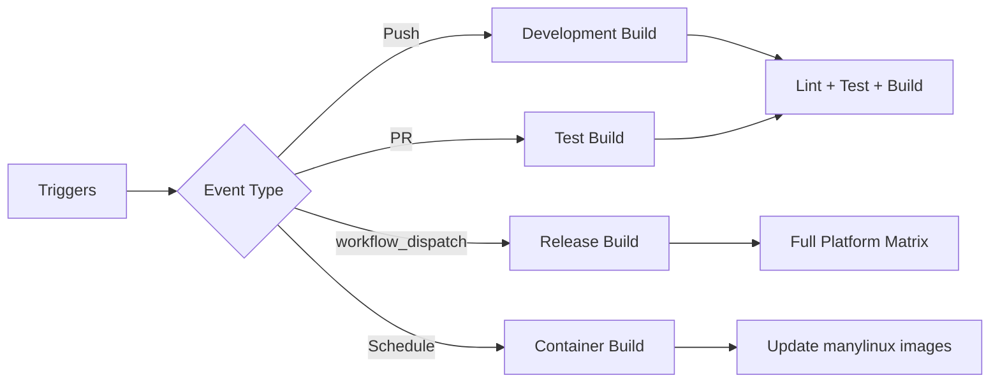

```mermaid
graph LR
    A[Triggers] --> B{Event Type}
    B -->|Push| C[Development Build]
    B -->|PR| D[Test Build]
    B -->|workflow_dispatch| E[Release Build]
    B -->|Schedule| F[Container Build]

    C --> G[Lint + Test + Build]
    D --> G
    E --> H[Full Platform Matrix]
    F --> I[Update manylinux images]
```
