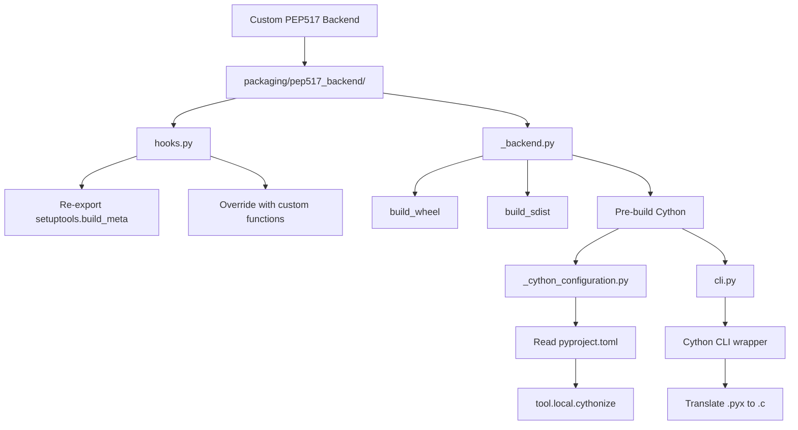

```mermaid
graph TD
    A[Custom PEP517 Backend] --> B[packaging/pep517_backend/]

    B --> C[hooks.py]
    C --> D[Re-export setuptools.build_meta]
    C --> E[Override with custom functions]

    B --> F[_backend.py]
    F --> G[build_wheel]
    F --> H[build_sdist]
    F --> I[Pre-build Cython]

    I --> J[_cython_configuration.py]
    J --> K[Read pyproject.toml]
    K --> L[tool.local.cythonize]

    I --> M[cli.py]
    M --> N[Cython CLI wrapper]
    N --> O[Translate .pyx to .c]
```
